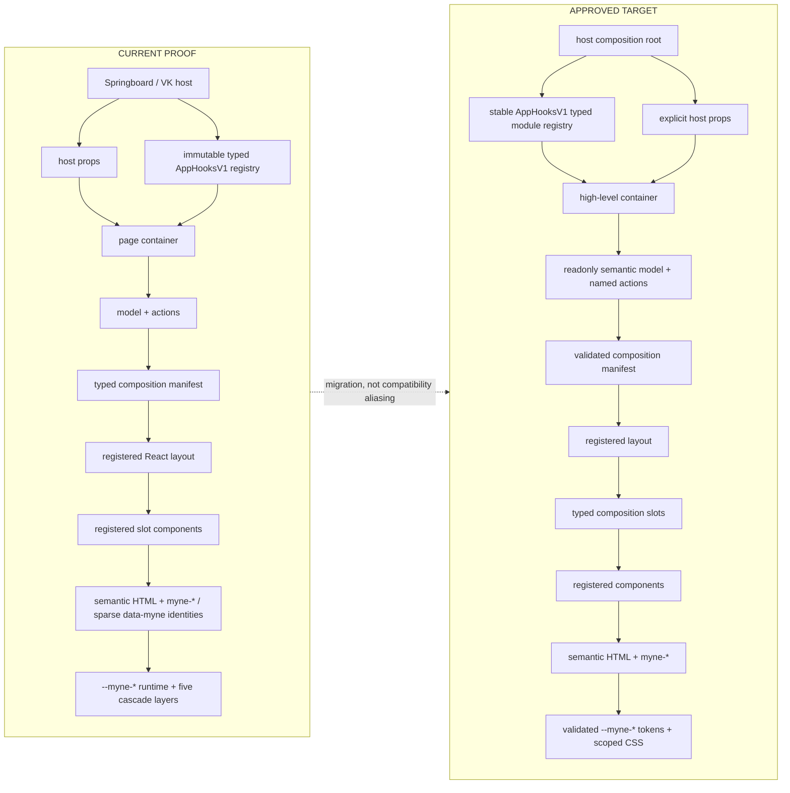
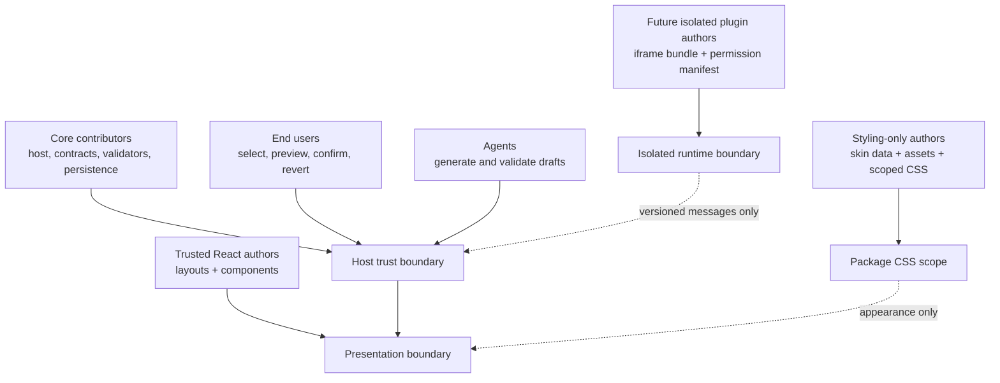
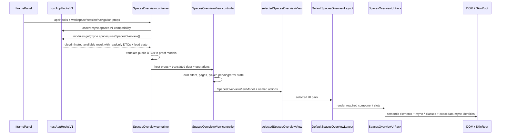
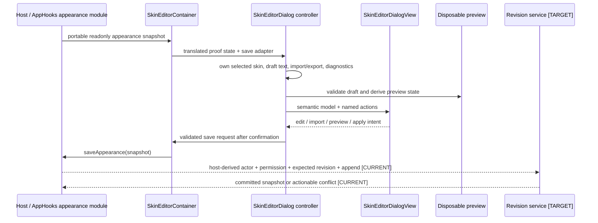
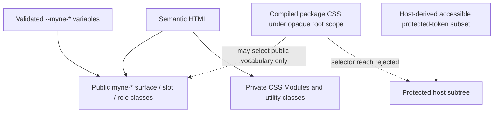

# `@myne` component tree and runtime architecture

This is the repository-grounded companion to the normative
[`@myne` v1 app customization contract](./myne-v1-contract.md). **If the two
documents disagree, the v1 contract wins for requirements.** Future XML
authoring work uses the UIC terminology and namespace decision in
[`docs/uic-terminology-migration.md`](./uic-terminology-migration.md), while
the `myne.*` identifiers described here remain the current production
compatibility IDs. Source links here describe the checked-in proof; they do not
turn implementation details into a public API.

Status markers are deliberate:

- **CURRENT PROOF** exists in this repository today.
- **APPROVED TARGET** is the reviewed v1 direction and may not exist yet.
- **FUTURE** is outside v1 and is not a compatibility promise.

The durable rule is dependency direction: hosts own data, authority, and side
effects; containers adapt them to semantic models and named actions; trusted
renderers compose those values; declarative skins affect appearance only.

## 1. Current proof and approved target

The current proof separates trusted layouts from registered components on both
proof surfaces, resolves typed versioned manifests and view-pack presets, passes
one `appHooks` prop to both proof-surface containers, and implements the approved
runtime-immutable typed AppHooks registry and `myne-*` DOM/token cutover. A
strict JSON-only portable snapshot v1 validator and canonical serializer now
cover both proof-surface composition selections, skin state, capabilities,
provenance, and SRI asset descriptors. The in-memory portable package reader now
verifies exact asset coverage, byte length, and SHA-256/384/512 integrity before
exposing defensive byte copies, and the scoped CSS compiler is implemented.
The production host now loads the persisted revision head, projects global skin,
density, and view-pack state, and activates compiler-verified CSS artifacts.

The registry replaces the earlier fixed `capabilities.spaces` /
`capabilities.appearance` proof. Each module has a stable ID and independent
version. The complete envelope always contains every published module ID;
omitted implementations resolve to stable unavailable adapters, while an
externally constructed registry missing even an optional published ID is
malformed. Discovery IDs must be unique, but additive IDs unknown to an older
consumer remain discoverable and do not make its root-v1 contract incompatible;
typed lookup remains limited to that consumer's known module map. Required
incompatibility fails before a hook consumer mounts.
Unavailable hooks remain callable in normal hook order and return stable
`{ available: false, reason }` results; available hooks return
`{ available: true, value }`.

## 2. Artifact vocabulary

These names are not interchangeable:

- A **layout** controls structure, ordering, and responsive placement. It can
  render only the typed slots declared by its surface contract.
- A **component implementation** renders one semantic role behind a registered
  component ID. It receives a presentation model and named actions, never host
  clients.
- A **typed composition slot** is a React replacement point with declared props
  and obligations. It is not a CSS selector.
- A **public styling slot** is a stable semantic DOM region such as target
  `myne-slot--workspace-list`. It does not identify executable code.
- A **composition manifest** is declarative data binding a compatible registered
  layout and registered components to every required typed slot.
- A **view-pack preset** is a shareable selection of a compatible composition
  manifest and allowed appearance defaults. Current SkinLab choices are
  Storybook fixture presets only, not production package resolution.
- A **skin** is non-executable data: validated tokens, recipes, assets,
  metadata, and approved compiled scoped CSS.

In v1, trusted React implementations are registered by reviewed source code.
Manifests select stable IDs; they cannot contain module paths, dynamic imports,
source code, or JavaScript.

## 3. Authors, imports, execution, and packages

| Party | May author/import | May execute | Boundary |
| --- | --- | --- | --- |
| Core contributor | Springboard composition, AppHooks adapters, contracts, validators, persistence, registered renderers | Host operations after normal authorization and validation | Reviewed application source |
| Trusted React renderer author | Published surface/model/action/slot contracts and approved React primitives | Only named actions received through props | Trusted in-process presentation; no Springboard, store, VK client, RPC, navigation, or server-action imports |
| Styling-only author | Versioned skin schema, public selectors/tokens, validated package assets | No JavaScript | Compiled package-root CSS scope |
| End user | Saved selections and disposable drafts through product UI | Authorized preview/apply/revert operations | Cannot directly mutate stored state or history |
| Agent | Published schemas and explicitly granted tools | Preview and, after the history gate, the same confirmed revision service as users | No direct production write or authorization bypass |
| Future plugin author | A separately versioned bridge SDK and declared permissions | Granted serialized RPC only | Separate-origin iframe by default; never raw `AppHooksV1` |

Capability availability says the host implements an API; it does not grant an
operation. Authorization and input validation run when each action executes.

Package kinds stay visibly separate. Skins, snapshots, revisions, composition
manifests, and presets are declarative. Trusted React view packs are reviewed
build-time packages. A future executable iframe plugin is a different artifact,
trust tier, installation flow, and protocol.

## 4. SpacesOverview vertical slice

The checked-in entry is [`SpacesOverview`](../src/components/SpacesOverview.tsx),
mounted by [`IframePanel`](../src/components/IframePanel.tsx). The host adapter
is [`hostAppHooksV1`](../src/app-hooks/AppHooks.host.ts); the public boundary is
[`AppHooksV1`](../src/app-hooks/AppHooks.ts).

`SpacesOverview` checks compatibility before rendering the hook-using child.
The container obtains portable readonly DTOs through `myne.spaces`; it does not
expose the VK client through the public contract. Other inputs still arrive as
explicit host props: workspace/tab-group state, saved sessions, navigation, and
open-workspace callbacks. [`SpacesOverviewView`](../src/components/SpacesOverview.tsx)
currently owns local interaction state and derives
`SpacesOverviewViewModel`/`SpacesOverviewViewActions` from all three sources.
Its name does not make it a presentation-only view.

The current composition seam is concrete:

- [`SpacesOverview.composition.ts`](../src/components/spaces-overview/SpacesOverview.composition.ts)
  owns the typed manifest, layout/component registry, compatibility checks, and
  default/dense view-pack presets.
- [`SpacesOverviewUIPack`](../src/components/spaces-overview/SpacesOverview.contracts.ts)
  is the layout-facing typed React component map produced by the resolver.
- [`SpacesOverview.slots.ts`](../src/components/spaces-overview/SpacesOverview.slots.ts)
  independently versions each real semantic region and projects only that
  region's model and action keys before a registered renderer is invoked.
- [`DefaultSpacesOverviewLayout`](../src/components/spaces-overview/DefaultSpacesOverview.view.tsx)
  orders those components.
- [`selectedSpacesOverviewView`](../src/components/spaces-overview/SpacesOverview.selected.ts)
  is explicit source selection.
- `denseSpacesOverviewManifest` proves a compatible per-slot override without
  coupling the view pack to a skin.
- [`createSkinLabStories`](../src/stories/skinLab.ts) builds deterministic
  Storybook matrices. It is not a production registry.

The proof now replaces selection-by-import conventions with validated manifest
IDs over reviewed layout/component registrations. Workspace loading, filtering,
pagination, navigation, picker behavior, pending states, and failures remain
container-owned semantics across every compatible renderer.

The shared resolver treats the registry's required-slot inventory as
authoritative. Every registration declares its slot identity and independent
contract version. Before any renderer is returned, resolution rejects missing
or extra slots, manifest/key identity mismatches, unknown components or
override keys, cross-slot substitutions, and version mismatches. Surface APIs
also narrow override IDs by slot, while runtime validation protects untyped
package input.

## 5. Skin Editor vertical slice

The current controller is
[`SkinEditorContainer`](../src/theme/skins/SkinEditorDialog.tsx). It checks and
unconditionally consumes `myne.appearance`, translates the portable appearance
snapshot into the proof skin schema, and passes only editor actions/state to
[`SkinEditorDialogView`](../src/theme/skins/SkinEditorDialog.view.tsx).
When the stable host replaces that snapshot, the controller reconciles its
local selection to the new active skin and clears draft, import/export,
diagnostic, status, and pending-save state rather than retaining a stale preset.
That replacement also invalidates any in-flight save: its later resolution,
rejection, cleanup, and success callback are ignored. Each mounted editor
serializes saves while its current request is pending; replacement permits a
new-generation save without allowing the older request to mutate UI state.

[`editor.ts`](../src/theme/skins/editor.ts) implements current draft helpers;
[`schema.ts`](../src/theme/skins/schema.ts) validates proof manifests and
import/export packages; [`runtime.ts`](../src/theme/skins/runtime.ts) projects
the current proof tokens. [`appearanceSnapshot.ts`](../src/theme/skins/appearanceSnapshot.ts)
validates and canonically serializes the portable full-appearance snapshot; the
normative persistence semantics are recorded in
[`myne-appearance-revisions.md`](./myne-appearance-revisions.md). Production
`hostAppHooksV1` supplies a stable appearance module backed by the persisted
history API. The Home workspace's Appearance entry migrates older state,
provides protected confirmation/recovery controls, and exposes the Skin Editor
plus history and compatible view-pack selection. Non-empty CSS stays inert data
until the host compiler accepts it; rejected CSS never reaches history.

The current Skin Editor composition proof is
[`SkinEditorDialog.composition.tsx`](../src/theme/skins/SkinEditorDialog.composition.tsx).
Its declarative view packs bind a registered dialog layout to six meaningful,
independently swappable regions: header, library, token editor, preview,
import/export, and diagnostics. Each region has its own versioned projection of
[`SkinEditorViewModel` and `SkinEditorViewActions`](../src/theme/skins/SkinEditorDialog.contracts.ts);
the registry adapter constructs those projections, so a renderer is not passed
surface-wide props or `AppHooksV1`. The compact-diagnostics preset demonstrates
a compatible one-region override while remaining independent of the active skin.

The current conformance inventory is centralized in
[`myne-contract-inventory.mjs`](../scripts/myne-contract-inventory.mjs). It
enumerates migrated files and stories, every required semantic slot, canonical
public class and runtime token, evidence markers, deterministic OpenLint
targets, and the narrow explicit negative/historical fixture exceptions. Both
production proof stories are linted; their preview framing uses the token-backed
`myne-preview-frame` class rather than a hardcoded palette utility.

Working draft, preview snapshot, and committed revision remain separate.
Import and default-revert workflows first stage the proposed snapshot as the
visible disposable preview. Changing its source or cancelling invalidates that
candidate immediately; confirmation submits only the retained handle that was
successfully rendered.
[`appearanceRevisions.ts`](../src/theme/skins/appearanceRevisions.ts) now provides
the shared append-only command service: undo, redo, restore, revert, user, agent,
CLI, import, and marketplace writes traverse canonical validation, authorization,
atomic store compare-and-swap, versioned immutable hash-chain verification, and expected-head concurrency. They create
compensating revisions rather than rewriting history. The in-memory conformance
store proves restart, corruption, persistence-failure, and concurrent-client
semantics. The node host now persists the aggregate with atomic replacement and
exposes one validated command shape to the app and `vk appearance`
inspect/snapshot/diff/restore/undo/revert/redo commands. HTTP payload identity is
never authorization input: the current single-user host derives local user
mutations from same-origin plus CSRF-guarded browser requests and derives CLI
mutations from a host-issued bearer credential on the same command endpoint.
Browser bodies cannot claim CLI/import/agent actor identity; import provenance is
a browser operation type. A future multi-user host must replace that resolver
with its authenticated principal without changing command-service semantics.
Private inspect, snapshot, and diff routes traverse the same principal resolver
and a separate read-authorization decision. Long-lived services refresh and
strictly validate the persisted winner before reads and mutations; filesystem
lock reclamation transfers a dead lock by atomic rename rather than deleting a
possibly replaced lock. Revisions bind stream/owner and activation
compiler/policy metadata. The reported v1 retention policy is retain-all with
asset GC disabled; checkpoints are verifiable audit markers with boundary
snapshot/digest, audit range/summary, and retained roots, not compaction.
Pre-activation-metadata histories are migrated under CAS. Token-only snapshots
derive deterministic metadata directly; active legacy custom CSS must compile
successfully under the current compiler policy before its rebuilt hash chain is
published. Invalid CSS fails closed, while corrupt primaries remain preserved
for diagnostics and may recover from a validated same-format last-known-good
backup.

## 6. Styling cascade and protected UI

Current proof output uses semantic elements, namespaced `myne-*` base/modifier
classes, sparse exact `data-myne-surface`/`slot`/`skin`/`view-pack` identities,
and compiled `--myne-*` variables. CSS Module names and layout-only Tailwind
utilities remain private implementation details.

The current [`scopedCss.ts`](../src/theme/skins/scopedCss.ts) compiler parses
package CSS to an AST, applies the versioned default-deny policy, rewrites it
below an opaque generated root, and compiles all-or-nothing. Its runtime consumes
the identical branded artifact for preview and activation and preserves a
last-known-good artifact or startup safe mode. The production appearance host
compiles active custom CSS into a disposable candidate before confirmation,
renders that candidate CSS in the preview root, disables confirmation until the
retained handle is current, and submits that exact handle without recompiling
after confirmation. The server recompiles/verifies its source/artifact binding
before a CAS revision records the snapshot plus compiler/policy activation
metadata. Source changes immediately invalidate the handle; rejected
or stale candidates leave active and persisted state untouched. Startup load
compiles again, exposes the same deterministic artifact digest to
preview/activation roots, and falls back to its last-known-good projection in
safe mode. Authorization, confirmation, diagnostics, safe-mode, and recovery
controls remain outside package selector scope or in a separately isolated
subtree. They can visually match through a host-derived token subset that
passes accessibility checks; arbitrary package selectors or tokens cannot hide,
spoof, cover, or disable the escape hatch.

## 7. Compatibility and state ownership

Compatibility checks proceed from package schema to artifact kind, target
contract version, surface version, required AppHooks module IDs/versions,
registered layout/component IDs, complete slot bindings, supported states,
assets, and compiled CSS integrity. Contract, capability, composition, skin,
snapshot, revision, and future bridge versions are distinct.

State ownership is similarly explicit:

| State | Owner |
| --- | --- |
| VK workspaces, repositories, execution | VK/backend and host adapter |
| Fetch/loading/refetch state | AppHooks module implementation |
| Filters, pagination, picker, pending actions | SpacesOverview container/controller |
| Skin draft, import/export text, draft diagnostics | Skin Editor controller |
| Preview appearance | Disposable preview scope |
| Active appearance and immutable history | Production host projection plus shared revision command service |
| Permission, confirmation, recovery state | Protected host UI |

## 8. Future extension points

**FUTURE:** component-scoped WebMCP may expose semantic inspection and explicitly
authorized actions, never arbitrary DOM mutation. **FUTURE:** DevTools-assisted
forking begins as CSS-only DOM/computed-style diffing that produces a draft for
the normal validator; it is not a hidden production write path. **FUTURE:**
runtime executable plugins require a separate-origin iframe, permission
manifest, versioned `postMessage` RPC, lifecycle/failure containment, signing,
and rollback. Existing iframe code is precedent only; it is not an implemented
`@myne` plugin runtime.

All future writes converge on host authorization, validation, confirmation,
optimistic concurrency, and append-only history. None receives raw AppHooks,
Springboard supervisors, stores, or private RPC clients.

## 9. Current-symbol source map and maintenance rule

| Role | Current symbol | Source |
| --- | --- | --- |
| Public host contract | `AppHooksV1`, `createAppHooksV1` | [`AppHooks.ts`](../src/app-hooks/AppHooks.ts) |
| Production Spaces adapter | `hostAppHooksV1`, `useHostSpacesOverview` | [`AppHooks.host.ts`](../src/app-hooks/AppHooks.host.ts) |
| Spaces container/controller | `SpacesOverview`, `SpacesOverviewView` | [`SpacesOverview.tsx`](../src/components/SpacesOverview.tsx) |
| Spaces model/actions/UI pack | `SpacesOverviewViewModel`, `SpacesOverviewViewActions`, `SpacesOverviewUIPack` | [`SpacesOverview.contracts.ts`](../src/components/spaces-overview/SpacesOverview.contracts.ts) |
| Spaces layout/selection | `DefaultSpacesOverviewLayout`, `selectedSpacesOverviewView` | [`DefaultSpacesOverview.view.tsx`](../src/components/spaces-overview/DefaultSpacesOverview.view.tsx), [`SpacesOverview.selected.ts`](../src/components/spaces-overview/SpacesOverview.selected.ts) |
| Spaces slot contracts/projections | `spacesOverviewSlotContracts`, `projectSpacesOverviewSlotProps` | [`SpacesOverview.slots.ts`](../src/components/spaces-overview/SpacesOverview.slots.ts) |
| Skin controller/view contract | `SkinEditorDialog`, `SkinEditorViewModel`, `SkinEditorViewActions` | [`SkinEditorDialog.tsx`](../src/theme/skins/SkinEditorDialog.tsx), [`SkinEditorDialog.contracts.ts`](../src/theme/skins/SkinEditorDialog.contracts.ts) |
| Skin layout/slot composition | `SkinEditorDialogLayout`, `skinEditorSlotContracts`, `projectSkinEditorSlotProps` | [`SkinEditorDialog.composition.tsx`](../src/theme/skins/SkinEditorDialog.composition.tsx) |
| Skin validation/runtime | `validateSkinManifest`, `getSkinRuntimeState` | [`schema.ts`](../src/theme/skins/schema.ts), [`runtime.ts`](../src/theme/skins/runtime.ts) |
| Storybook matrix | `createSkinLabStories` | [`skinLab.ts`](../src/stories/skinLab.ts) |

Links intentionally use repository-relative files and symbol names, not line
anchors or generated class names. Update this document only when ownership,
dependency direction, trust, lifecycle, or a public boundary changes. Internal
calculations, hook implementations, CSS declarations, and incidental wrappers
belong in source and tests rather than here.
