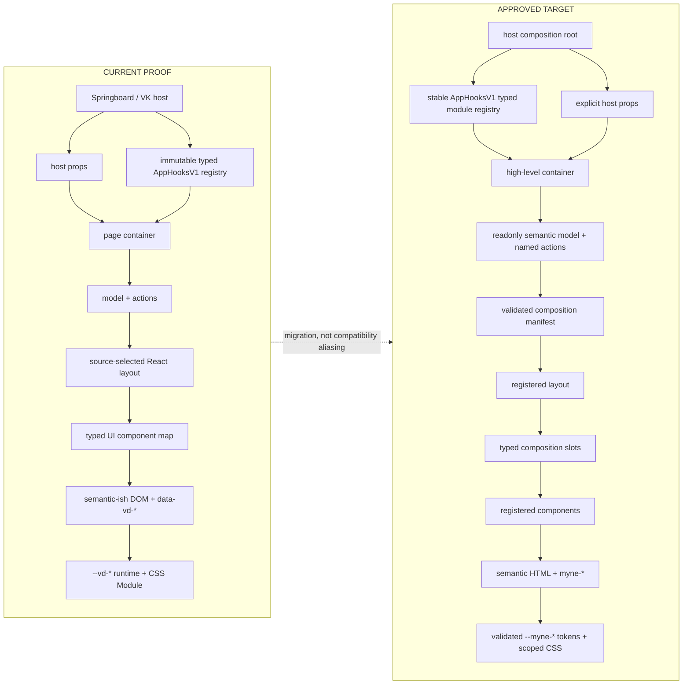
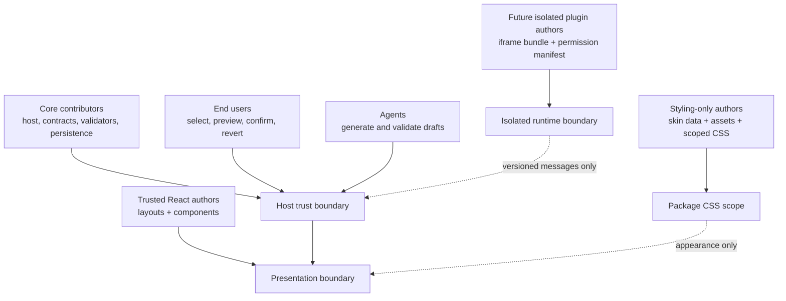
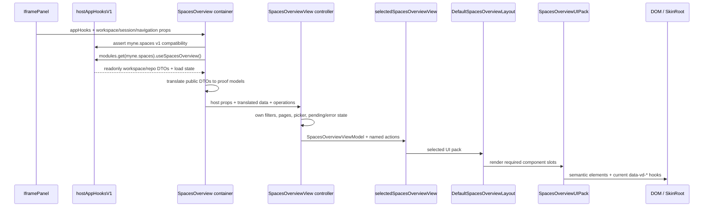
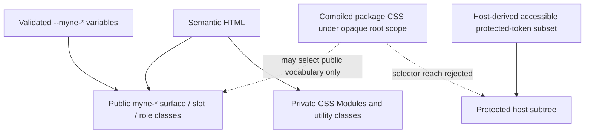

# `@myne` component tree and runtime architecture

This is the repository-grounded companion to the normative
[`@myne` v1 app customization contract](./myne-v1-contract.md). **If the two
documents disagree, the v1 contract wins for requirements.** Source links here
describe the checked-in proof; they do not turn implementation details into a
public API.

Status markers are deliberate:

- **CURRENT PROOF** exists in this repository today.
- **APPROVED TARGET** is the reviewed v1 direction and may not exist yet.
- **FUTURE** is outside v1 and is not a compatibility promise.

The durable rule is dependency direction: hosts own data, authority, and side
effects; containers adapt them to semantic models and named actions; trusted
renderers compose those values; declarative skins affect appearance only.

## 1. Current proof and approved target

The current proof separates the SpacesOverview layout from its components,
passes one `appHooks` prop to both proof-surface containers, and implements the
approved runtime-immutable typed AppHooks registry. It does not yet implement
the target React layout/component registries, composition-manifest validation,
package loader, revision service, or `myne-*` DOM cutover.

The registry replaces the earlier fixed `capabilities.spaces` /
`capabilities.appearance` proof. Each module has a stable ID and independent
version. Required incompatibility fails before a hook consumer mounts; an
optional unavailable module remains present as a stable, hook-safe adapter.

## 2. Artifact vocabulary

These names are not interchangeable:

- A **layout** controls structure, ordering, and responsive placement. It can
  render only the typed slots declared by its surface contract.
- A **component implementation** renders one semantic role behind a registered
  component ID. It receives a presentation model and named actions, never host
  clients.
- A **typed composition slot** is a React replacement point with declared props
  and obligations. It is not a CSS selector.
- A **public styling slot** is a stable semantic DOM region such as target
  `myne-slot--workspace-list`. It does not identify executable code.
- A **composition manifest** is declarative data binding a compatible registered
  layout and registered components to every required typed slot.
- A **view-pack preset** is a shareable selection of a compatible composition
  manifest and allowed appearance defaults. Current SkinLab choices are
  Storybook fixture presets only, not production package resolution.
- A **skin** is non-executable data: validated tokens, recipes, assets,
  metadata, and approved compiled scoped CSS.

In v1, trusted React implementations are registered by reviewed source code.
Manifests select stable IDs; they cannot contain module paths, dynamic imports,
source code, or JavaScript.

## 3. Authors, imports, execution, and packages

| Party | May author/import | May execute | Boundary |
| --- | --- | --- | --- |
| Core contributor | Springboard composition, AppHooks adapters, contracts, validators, persistence, registered renderers | Host operations after normal authorization and validation | Reviewed application source |
| Trusted React renderer author | Published surface/model/action/slot contracts and approved React primitives | Only named actions received through props | Trusted in-process presentation; no Springboard, store, VK client, RPC, navigation, or server-action imports |
| Styling-only author | Versioned skin schema, public selectors/tokens, validated package assets | No JavaScript | Compiled package-root CSS scope |
| End user | Saved selections and disposable drafts through product UI | Authorized preview/apply/revert operations | Cannot directly mutate stored state or history |
| Agent | Published schemas and explicitly granted tools | Preview and, after the history gate, the same confirmed revision service as users | No direct production write or authorization bypass |
| Future plugin author | A separately versioned bridge SDK and declared permissions | Granted serialized RPC only | Separate-origin iframe by default; never raw `AppHooksV1` |

Capability availability says the host implements an API; it does not grant an
operation. Authorization and input validation run when each action executes.

Package kinds stay visibly separate. Skins, snapshots, revisions, composition
manifests, and presets are declarative. Trusted React view packs are reviewed
build-time packages. A future executable iframe plugin is a different artifact,
trust tier, installation flow, and protocol.

## 4. SpacesOverview vertical slice

The checked-in entry is [`SpacesOverview`](../src/components/SpacesOverview.tsx),
mounted by [`IframePanel`](../src/components/IframePanel.tsx). The host adapter
is [`hostAppHooksV1`](../src/app-hooks/AppHooks.host.ts); the public boundary is
[`AppHooksV1`](../src/app-hooks/AppHooks.ts).

`SpacesOverview` checks compatibility before rendering the hook-using child.
The container obtains portable readonly DTOs through `myne.spaces`; it does not
expose the VK client through the public contract. Other inputs still arrive as
explicit host props: workspace/tab-group state, saved sessions, navigation, and
open-workspace callbacks. [`SpacesOverviewView`](../src/components/SpacesOverview.tsx)
currently owns local interaction state and derives
`SpacesOverviewViewModel`/`SpacesOverviewViewActions` from all three sources.
Its name does not make it a presentation-only view.

The current composition seam is concrete:

- [`SpacesOverviewUIPack`](../src/components/spaces-overview/SpacesOverview.contracts.ts)
  is a typed React component map.
- [`DefaultSpacesOverviewLayout`](../src/components/spaces-overview/DefaultSpacesOverview.view.tsx)
  orders those components.
- [`selectedSpacesOverviewView`](../src/components/spaces-overview/SpacesOverview.selected.ts)
  is explicit source selection.
- [`denseWorkspaceListSpacesOverviewUI`](../src/components/spaces-overview/SpacesOverview.alternates.ts)
  proves one swappable component slot.
- [`createSkinLabStories`](../src/stories/skinLab.ts) builds deterministic
  Storybook matrices. It is not a production registry.

The target replaces selection-by-import conventions with validated manifest
IDs over reviewed layout/component registrations. Workspace loading, filtering,
pagination, navigation, picker behavior, pending states, and failures remain
container-owned semantics across every compatible renderer.

## 5. Skin Editor vertical slice

The current controller is
[`SkinEditorContainer`](../src/theme/skins/SkinEditorDialog.tsx). It checks and
unconditionally consumes `myne.appearance`, translates the portable appearance
snapshot into the proof skin schema, and passes only editor actions/state to
[`SkinEditorDialogView`](../src/theme/skins/SkinEditorDialog.view.tsx).

[`editor.ts`](../src/theme/skins/editor.ts) implements current draft helpers;
[`schema.ts`](../src/theme/skins/schema.ts) validates proof manifests and
import/export packages; [`runtime.ts`](../src/theme/skins/runtime.ts) projects
the current proof tokens. Production `hostAppHooksV1` still supplies an
unavailable appearance adapter, so Storybook/test persistence is not evidence
of a production settings or revision service. Raw CSS remains deferred and must
not preview or persist before the protected compiler work is complete.

The target keeps working draft, preview snapshot, and committed revision
separate. History is append-only: undo, redo, restore, and agent writes create
compensating revisions through the same authorization, validation, confirmation,
and optimistic-concurrency service. They never rewrite history or directly move
a mutable current pointer.

## 6. Styling cascade and protected UI

Current proof output uses `data-vd-*`, `VD*` primitives, and `--vd-*`; target
output uses semantic elements plus coarse `myne-*` classes and `--myne-*`
variables. CSS Module names and Tailwind utilities remain private implementation
details in both cases.

Package CSS is parsed, default-denied, rewritten below an opaque generated root,
and compiled all-or-nothing. Preview and activation consume the identical
artifact. Authorization, confirmation, diagnostics, safe-mode, and recovery
controls remain outside package selector scope or in a separately isolated
subtree. They can visually match through a host-derived token subset that
passes accessibility checks; arbitrary package selectors or tokens cannot hide,
spoof, cover, or disable the escape hatch.

## 7. Compatibility and state ownership

Compatibility checks proceed from package schema to artifact kind, target
contract version, surface version, required AppHooks module IDs/versions,
registered layout/component IDs, complete slot bindings, supported states,
assets, and compiled CSS integrity. Contract, capability, composition, skin,
snapshot, revision, and future bridge versions are distinct.

State ownership is similarly explicit:

| State | Owner |
| --- | --- |
| VK workspaces, repositories, execution | VK/backend and host adapter |
| Fetch/loading/refetch state | AppHooks module implementation |
| Filters, pagination, picker, pending actions | SpacesOverview container/controller |
| Skin draft, import/export text, draft diagnostics | Skin Editor controller |
| Preview appearance | Disposable preview scope |
| Active appearance and immutable history | Host persistence/revision service, once implemented |
| Permission, confirmation, recovery state | Protected host UI |

## 8. Future extension points

**FUTURE:** component-scoped WebMCP may expose semantic inspection and explicitly
authorized actions, never arbitrary DOM mutation. **FUTURE:** DevTools-assisted
forking begins as CSS-only DOM/computed-style diffing that produces a draft for
the normal validator; it is not a hidden production write path. **FUTURE:**
runtime executable plugins require a separate-origin iframe, permission
manifest, versioned `postMessage` RPC, lifecycle/failure containment, signing,
and rollback. Existing iframe code is precedent only; it is not an implemented
`@myne` plugin runtime.

All future writes converge on host authorization, validation, confirmation,
optimistic concurrency, and append-only history. None receives raw AppHooks,
Springboard supervisors, stores, or private RPC clients.

## 9. Current-symbol source map and maintenance rule

| Role | Current symbol | Source |
| --- | --- | --- |
| Public host contract | `AppHooksV1`, `createAppHooksV1` | [`AppHooks.ts`](../src/app-hooks/AppHooks.ts) |
| Production Spaces adapter | `hostAppHooksV1`, `useHostSpacesOverview` | [`AppHooks.host.ts`](../src/app-hooks/AppHooks.host.ts) |
| Spaces container/controller | `SpacesOverview`, `SpacesOverviewView` | [`SpacesOverview.tsx`](../src/components/SpacesOverview.tsx) |
| Spaces model/actions/UI pack | `SpacesOverviewViewModel`, `SpacesOverviewViewActions`, `SpacesOverviewUIPack` | [`SpacesOverview.contracts.ts`](../src/components/spaces-overview/SpacesOverview.contracts.ts) |
| Spaces layout/selection | `DefaultSpacesOverviewLayout`, `selectedSpacesOverviewView` | [`DefaultSpacesOverview.view.tsx`](../src/components/spaces-overview/DefaultSpacesOverview.view.tsx), [`SpacesOverview.selected.ts`](../src/components/spaces-overview/SpacesOverview.selected.ts) |
| Skin controller/view contract | `SkinEditorDialog`, `SkinEditorViewModel`, `SkinEditorViewActions` | [`SkinEditorDialog.tsx`](../src/theme/skins/SkinEditorDialog.tsx), [`SkinEditorDialog.contracts.ts`](../src/theme/skins/SkinEditorDialog.contracts.ts) |
| Skin validation/runtime | `validateSkinManifest`, `getSkinRuntimeState` | [`schema.ts`](../src/theme/skins/schema.ts), [`runtime.ts`](../src/theme/skins/runtime.ts) |
| Storybook matrix | `createSkinLabStories` | [`skinLab.ts`](../src/stories/skinLab.ts) |

Links intentionally use repository-relative files and symbol names, not line
anchors or generated class names. Update this document only when ownership,
dependency direction, trust, lifecycle, or a public boundary changes. Internal
calculations, hook implementations, CSS declarations, and incidental wrappers
belong in source and tests rather than here.
