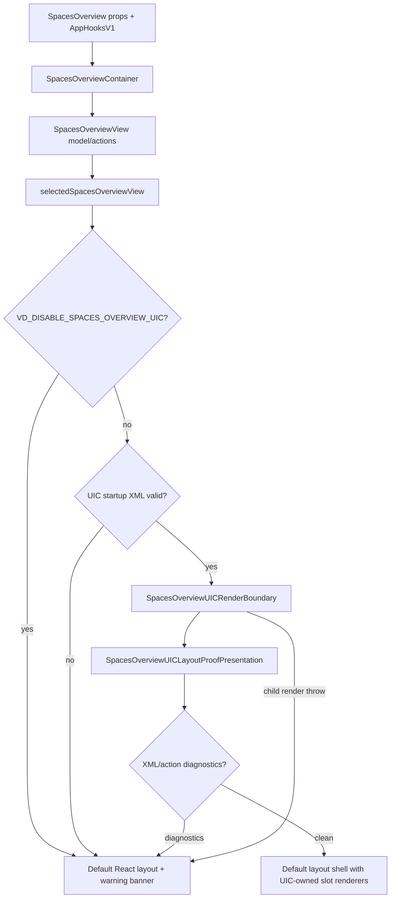

# SpacesOverview UIC parity plan

## Goal

Make the production-default UIC SpacesOverview surface match the original trusted React page in functionality, content, styling intent, and accessibility while preserving:

- React fallback rendering.
- `VD_DISABLE_SPACES_OVERVIEW_UIC` as the production kill switch.
- Startup/render validation and visible nonblocking fallback diagnostics.
- The current trust boundary: UIC XML declares only known tags/events; data projection, state ownership, and action execution stay in trusted React/container code.

This is a parity plan only. It does not authorize Marketplace/package authoring, broad arbitrary-page UIC runtime work, or removal of React fallbacks.

## Source inventory

Primary source files:

- Original React container/model: `src/components/SpacesOverview.tsx`
- Original React layout and default slots: `src/components/spaces-overview/DefaultSpacesOverview.view.tsx`
- Original craft/session sections: `src/components/spaces-overview/craftSections.view.tsx`
- Original running server rows: `src/components/spaces-overview/RunningDevServersSection.view.tsx`
- Original workspace rows/filter/pagination: `src/components/spaces-overview/workspaceList.view.tsx`
- Original space picker modal: `src/components/spaces-overview/SpacePickerModal.view.tsx`
- Production view selection/fallback: `src/components/spaces-overview/SpacesOverview.selected.ts`
- Current UIC XML/projections/actions/renderers/fallback: `src/components/spaces-overview/SpacesOverview.uic.view.tsx`
- UIC XML/tag/event validation: `src/uic/trustedComponents.ts`
- Storybook fixtures/states: `src/components/SpacesOverview.stories.tsx`

Related current bug status:

- `vkvw-8xaj.18.12 — Fix preview React DOM client export error after UIC production default` is still open. The local fix is committed as `e9e5a387` by upgrading Springboard from `0.0.1-dev-jamapp-12` to `0.0.1-dev-jamapp-16`. Local preview no longer shows the `react-dom/client` default-export error; the jamtools URL is Cloudflare Access-gated in this session.

## Current production flow

The current UIC implementation still uses `DefaultSpacesOverviewLayout` for the page shell. UIC owns selected slot internals by replacing `defaultSpacesOverviewUI` entries after XML validation.

## Section-by-section parity inventory

Legend:

- **Covered**: materially implemented in UIC.
- **Gap**: required for parity.
- **Decision**: product/engineering choice to confirm before implementation.

### Page shell and fallback

Original React:

- `SkinRoot` wraps the view with current skin and optional appearance artifact.
- `<main>` uses `data-myne-surface="spaces-overview"`, default/dense view-pack identity, full-height scroll, `p-6 md:p-8`, and centered `max-w-4xl` content.
- React fallback is the canonical trusted implementation.

Current UIC:

- Covered: production defaults to UIC unless `VD_DISABLE_SPACES_OVERVIEW_UIC` is truthy (`1`, `true`, `yes`, `on`).
- Covered: startup validation and render boundary fall back to React with a visible diagnostic banner.
- Covered: shell still comes from `DefaultSpacesOverviewLayout`, so top-level surface/skin wiring is preserved.
- Gap: UIC proof view-pack id is `uic.spaces.layout-shell.proof`; decide whether final production parity keeps this id, renames it, or uses a separate `uic.spaces.view-pack.default`.

### Page header

Original React:

- Shows `Dashboard` and `Workspace activity feed`.
- No header action button in the original default slot.

Current UIC:

- Covered: renders through `DefaultPageHeader`.
- Gap: XML contains a fixture `<uic:pageHeaderAction label="Start voyage" />`, but it is not rendered as a header action.
- Decision: remove the unused fixture for parity, or intentionally promote a header action and move/duplicate the `New Voyage` affordance.

### Recent sessions / “All Voyages”

Original React:

- Hidden when there are no saved sessions.
- Header has `All Voyages` and `New Voyage`.
- Sessions are sorted by `updatedAt`.
- Row click and `Enter`/`Space` on row resume the voyage.
- Expand/collapse button exposes nested craft rows.
- Expanded craft rows navigate with `navigateToTabGroup` and show active craft badge.
- Rename flow has a visible `Rename` control, inline input, `Enter` submit, `Escape` cancel, and `blur` submit.
- Delete flow uses a blocking confirmation prompt before `deleteSession`.
- Current session badge appears inline.
- Empty expanded session copy says the voyage can recover fallback craft.

Current UIC:

- Covered: bounded/deduped session projection, start/resume/toggle/nested craft navigation, current/expanded/editing meta, delete/rename descriptors, XML-bound action availability.
- Gap: empty UIC state renders `No saved voyages`; original hides the entire section.
- Gap: visible subtitle `Read-only UIC voyage list` is implementation language not present in original.
- Gap: row resume is an explicit `Resume voyage` button, not full-row click plus keyboard parity.
- Gap: rename cannot be initiated from UIC unless `editingSessionId`/draft already exist; no UIC `Rename` button starts edit mode and no inline input appears.
- Gap: delete button currently calls the lifecycle with `confirmed: false`; there is no rendered confirmation UI, so destructive deletion is not user-completable in UIC.
- Gap: nested craft rows have different card/list styling and action label compared with original whole-row button.
- Gap: expanded empty copy and active badge styling/content need exact comparison.
- Accessibility gap: original row is keyboard-operable via `role="button"` and key handler; UIC needs equivalent native button/ARIA semantics for resume, expand/collapse, nested craft navigation, rename, and delete confirmation.

### Starred craft

Original React:

- Hidden when empty.
- Rows are full-width buttons with label, space name, view count, pair count, and chevron.

Current UIC:

- Covered: bounded starred projection and `spaces.navigateToCraft`.
- Gap: empty UIC state renders `No starred craft`; original hides the section.
- Gap: subtitle `Read-only UIC list`, count text, list/card styling, and separate `Open craft` button differ from original row/button/chevron treatment.
- Gap: pair count is currently missing from UIC metadata.

### Running dev servers

Original React:

- Hidden while loading or when no running/stopping server rows exist.
- Shows only workspaces with `has_running_dev_server` or a pending stop id.
- Header has pulse dot, `Running Dev Servers`, and workspace count.
- Reuses `WorkspaceRow`, including branch, repos, diff stats, PR/status badges, unseen dot, dev server badge, stop button, and either `Go to craft` or `Open`.
- Stop calls trusted `stopDevServer`.
- Running row can navigate to linked craft or open a space picker for unlinked workspace.

Current UIC:

- Covered: bounded running-server projection, stop lifecycle descriptor, navigate/open descriptors, current-state target gating.
- Gap: UIC resource only includes `has_running_dev_server`; original also keeps rows visible while `stoppingDevServerIds` contains the workspace.
- Gap: empty/loading states render a UIC section; original hides this section for loading/empty.
- Gap: stop confirmation lifecycle has no rendered confirmation UI, so stop is not user-completable from UIC unless confirmation UI is added.
- Gap: UIC rows omit diff stats, PR/status badges, unseen dot, dev server badge, and relative time.
- Gap: header pulse/count styling is not exact.

### Recently visited craft

Original React:

- Hidden when empty.
- Shows rows with label, space, views/pairs, last visited relative time, chevron.
- Paginates at `TAB_GROUP_PAGE_SIZE` (10), with `Page X of Y`, `Previous`, and `Next`.

Current UIC:

- Covered: bounded/deduped projection, navigation descriptors, page descriptors.
- Gap: empty UIC state renders instead of hiding.
- Gap: subtitle/count text and separate action button differ from original row button/chevron.
- Gap: pair count is missing.
- Gap: pagination labels are `Previous page`/`Next page` and omit `Page X of Y`.

### Recently created craft

Original React:

- Same structure as Recently Visited, but time label uses `createdAt`.

Current UIC:

- Covered: bounded/deduped projection, navigation descriptors, page descriptors.
- Gaps: same as Recently Visited.

### Workspace list

Original React:

- Always renders a `VK Workspaces` section.
- Header count uses `sortedWorkspaces.length`, not current page length.
- Repo filter uses horizontal scroll, `All`, repo display/name, selected accent styling.
- Loading state shows centered spinner.
- Error state shows error plus `VK backend may not be running`.
- Empty state copy distinguishes selected repo (`No workspaces for this repository`) vs all (`No active workspaces`).
- Ready state renders `pagedWorkspaces` only, page size 20.
- `WorkspaceRow` shows unseen dot, pinned marker, name, branch, repo badges, diff stats, dev server badge, PR badge, process/status badge, relative time.
- Row actions: stop server when running/stopping, `Go to craft` when linked, otherwise `Open` when opening in a space is available.
- Pagination shows `Page X of Y`, disabled buttons at boundaries.

Current UIC:

- Covered: repo filter descriptors, page descriptors, open/navigate/stop descriptors, bounded projection, duplicate diagnostics.
- Gap: resource/action targets use `sortedWorkspaces` rather than `pagedWorkspaces`; changing page may not change the rendered rows/actions.
- Gap: count uses rendered UIC item count, not total filtered workspace count.
- Gap: loading state is text, not spinner.
- Gap: error state omits `VK backend may not be running`.
- Gap: empty state does not distinguish selected repo from global empty.
- Gap: workspace rows omit pinned marker, unseen dot, diff stats, dev server badge, PR badge, process/status badge, relative time, and repo badge styling.
- Gap: stop lifecycle has no rendered confirmation UI.
- Gap: pagination lacks `Page X of Y` and disabled boundary affordances.
- Accessibility gap: row action labels/titles should match original `Go to "label"` and `Open ${workspace.name}` semantics.

### All Spaces

Original React:

- Hidden when no non-system spaces.
- Preceded by a divider.
- Groups tab groups by non-system space.
- Space header shows space name and craft count.
- Craft rows are full-width buttons with label, view/pair counts, chevron.

Current UIC:

- Covered: bounded/deduped grouped projection and craft navigation.
- Gap: empty UIC section renders `No spaces`; original hides the section.
- Gap: divider is missing because the UIC slot replaces only `SpacesSection`.
- Gap: pair count and chevron/full-row styling differ.
- Gap: group/card styling and count text differ.

### Space picker modal

Original React:

- Renders only when `spacePickerTarget && canOpenWorkspaceInSpace`.
- Overlay closes on backdrop when not pending.
- Dialog is `aria-modal`, labelled by title, displays target workspace name.
- Error alert includes Retry when retry request exists.
- Space rows show space name, pending `Opening…`, and craft count.
- Empty copy: `No spaces available. Create a space first.`
- Cancel button is disabled while pending.

Current UIC:

- Covered: close/retry/select descriptors, current-state gating, error alert, pending text, bounded/deduped spaces, trusted `runOpenCraftRequest`.
- Gap: backdrop click close is absent.
- Gap: space rows omit craft count and per-row pending marker.
- Gap: empty spaces copy is absent when no select actions render.
- Gap: close label is `Close picker`; original says `Cancel`.
- Gap: pending state hides descriptors entirely; verify whether this matches disabled original controls or should render disabled controls for parity.

## Ordered implementation slices

All slices preserve React fallback and `VD_DISABLE_SPACES_OVERVIEW_UIC`.

1. **UIC parity test harness and inventories**
   - Add focused tests that can render original React and UIC side by side for the same Storybook fixtures.
   - Assert region presence/absence, key labels, action availability, fallback banners, and kill switch.
   - No visual changes except test fixtures.

2. **Hide/show and copy parity**
   - Match original hidden-empty behavior for RecentSessions, Starred, RunningDevServers, RecentlyVisited, RecentlyCreated, and Spaces.
   - Remove implementation subtitles (`Read-only UIC ...`) or make them test-only diagnostics not visible in production.
   - Restore original empty/error copy for WorkspaceList and SpacePicker.

3. **Workspace pagination correctness**
   - Change UIC workspace projection and action target inventory to use `pagedWorkspaces`.
   - Keep header count based on `sortedWorkspaces.length`.
   - Add tests proving page changes alter rendered rows/actions and preserve filter reset behavior.

4. **WorkspaceRow content parity**
   - Project/render pinned marker, unseen dot, repo badges, diff stats, dev server badge, PR badge, status badge, relative time, linked craft title, and open label.
   - Keep bounded projection caps and diagnostics.
   - Reuse existing trusted formatting helpers where possible.

5. **Craft row content/style parity**
   - Add pair counts and chevron/full-row button treatment for Starred, RecentlyVisited, RecentlyCreated, Spaces, and RecentSessions nested craft.
   - Restore `Page X of Y` labels and original pagination button labels/disabled semantics.

6. **RecentSessions rename parity**
   - Split `uic:on-rename` into trusted start/edit/submit/cancel behavior or introduce narrow event attrs for start/cancel/submit if needed.
   - Render inline input with Enter/Escape/blur behavior.
   - Exact-shape validate descriptor args and keep state in trusted container.

7. **Shared confirmation UI for destructive actions**
   - Render trusted confirmation UI for stop/delete descriptors.
   - Confirmed action dispatch must happen only after explicit confirmation.
   - Cover running dev server stop, workspace row stop, and session delete.

8. **RunningDevServers parity**
   - Include stopping rows while stop is pending.
   - Match header pulse/count and row content/action styling.
   - Ensure open/navigate/stop targets are derived from rendered rows only.

9. **SpacePicker modal parity**
   - Add backdrop close when not pending.
   - Add craft counts, per-space pending marker, disabled controls while pending, exact empty copy, and original Cancel label.
   - Verify keyboard/focus behavior or record the minimal additional focus-management slice.

10. **Accessibility and visual regression gate**
    - Storybook coverage for populated, loading, error, empty, repo-filtered, running, linked/open actions, picker open/error, pending stop, mobile density, and skins.
    - Playwright/a11y checks for keyboard activation, dialog semantics, destructive confirmation, route fallback, and kill switch.

## Validation matrix

| Area | Unit/component tests | Route/Playwright | Storybook/visual | Accessibility |
| --- | --- | --- | --- | --- |
| Fallback/kill switch | `isSpacesOverviewUICDisabled`, startup/render fallback tests | Production route with unset and `VD_DISABLE_SPACES_OVERVIEW_UIC=1` | Fallback banner story/fixture | Banner `role=status` |
| XML/action binding | Invalid/missing `uic:on-*`, unknown URL-like values | N/A | UIC proof story diagnostics | No functions/URLs/AppHooks exposed |
| RecentSessions | Empty hidden, resume, expand, nested craft, rename, delete confirm | Keyboard row resume and destructive confirm | Populated/current/expanded/editing states | Native buttons or equivalent key support |
| Craft lists | Hidden empty, labels/meta/pair counts, pagination | Navigate action dispatch per section | Starred/Visited/Created populated + empty | Row button names include craft labels |
| RunningDevServers | Running and stopping row projection, stop confirm, open/navigate | Stop confirmation no dispatch before confirm | Running/pending-stop fixtures | Destructive confirmation announced |
| WorkspaceList | Filter, paged rows, count, badges/meta, stop/open/navigate | Pagination changes visible rows | Desktop/mobile + status/diff fixtures | Button labels/titles, disabled semantics |
| Spaces | Hidden empty, divider, groups, counts, craft navigation | Navigate action dispatch | Grouped spaces fixture | Heading hierarchy |
| SpacePicker | Open/error/retry/pending/empty/select/close | Backdrop close, retry/select dispatch | Picker open/error/pending fixtures | `role=dialog`, label, focus/keyboard |

Minimum pre-review commands after implementation slices:

- `npm run check-types`
- Focused `vitest` suites for `SpacesOverview.uic`, production fallback, and any new parity tests
- `npm test` before parent closure review
- `npm run lint:ui-customization`
- `npm run build:web`
- `npm run build-storybook` for visual/story slices
- Playwright route smoke for local production preview, including kill switch and fallback diagnostics

## Risks and rollback

- **Risk: UIC appears production-default but still has visible proof-only copy.** Treat visible `Read-only UIC ...` text as a production blocker.
- **Risk: pagination/action targets diverge.** Use rendered-row-derived allowed target maps for every action.
- **Risk: destructive action bypass or dead control.** Stop/delete must either show explicit confirmation and dispatch after confirmation, or be unavailable with an honest diagnostic; no one-click destructive dispatch.
- **Risk: bounded projections hide legitimate user data.** Keep caps deterministic and diagnostic, but decide whether production parity requires larger caps or virtualization before broad rollout.
- **Risk: accessibility regression from div/button differences.** Prefer native buttons and labeled dialogs over custom key handlers.
- **Rollback:** set `VD_DISABLE_SPACES_OVERVIEW_UIC=1` to use the trusted React page. Runtime render/startup failures already show React fallback with a diagnostic banner.

## Blockers vs nice-to-have polish

Production parity blockers:

- WorkspaceList must render current page (`pagedWorkspaces`) rather than always the first bounded slice.
- Visible proof-only subtitles/copy must be removed or moved to diagnostics.
- Original hidden-empty behavior must be restored where the React page hides sections.
- Rename and destructive confirmation flows must be actually usable from UIC.
- Workspace/running rows must include the core information users rely on: status, PR/process badges, diff stats, dev server state, repo/branch, and time.
- SpacePicker must expose select/cancel/retry/pending/error with original user-facing semantics.
- Accessibility for keyboard activation, dialogs, disabled states, and destructive confirmation must be verified.

Nice-to-have polish:

- Pixel-perfect spacing/elevation matching beyond semantic parity.
- Animation parity for every pulse/spinner if semantic loading/pending states are already clear.
- Refactoring UIC projections into smaller files before parity is proven.
- App-wide UIC policy beyond completed SpacesOverview.

## Open decisions for form

1. Should final UIC parity hide empty optional sections exactly like React, or may it show explicit empty states for discoverability?
2. Should destructive actions use a shared inline confirmation pattern, browser `confirm`, or a modal confirmation matching future UIC conventions?
3. Should UIC keep deterministic row caps in production, and if so what cap levels are acceptable before showing diagnostics?
4. Should the unused `pageHeaderAction` fixture be removed for parity or promoted into a real `New Voyage` header action?
5. Should visual acceptance require pixel-level screenshot diffs, curated reviewer screenshots, or semantic DOM/a11y plus Storybook review?
6. Should completion target exact default React view only, or also dense view-pack parity before closing the parent proof?
