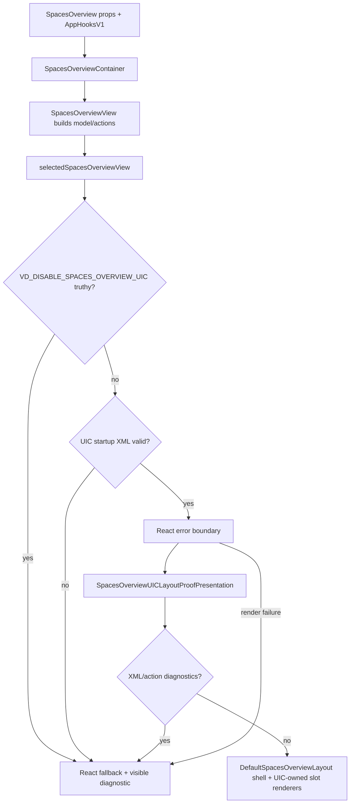

# SpacesOverview UIC parity plan

## Scope and non-goals

Goal: make the production-default UIC SpacesOverview surface match the original trusted React page in functionality, user-visible content, styling intent, and accessibility.

Required invariants:

- Preserve React fallback rendering.
- Preserve `VD_DISABLE_SPACES_OVERVIEW_UIC` as the production kill switch.
- Preserve startup/render validation and visible nonblocking fallback diagnostics.
- Keep state ownership, authorization, async work, and action execution in trusted React/container code.
- Keep UIC XML declarative: generated tags and named `uic:on-*` events only; no functions, URLs, AppHooks, promises, raw QueryClient, or method names in XML.

Non-goals:

- No Marketplace/package-authoring work.
- No broad arbitrary-page UIC runtime.
- No removal of React fallback.
- No app-wide UIC policy beyond completed SpacesOverview unless separately approved.

## Architecture map

Primary source files:

- Original trusted React model/container: `src/components/SpacesOverview.tsx`
- Original trusted React shell/slots: `src/components/spaces-overview/DefaultSpacesOverview.view.tsx`
- Original craft/session sections: `src/components/spaces-overview/craftSections.view.tsx`
- Original running server rows: `src/components/spaces-overview/RunningDevServersSection.view.tsx`
- Original workspace rows/filter/pagination: `src/components/spaces-overview/workspaceList.view.tsx`
- Original picker modal: `src/components/spaces-overview/SpacePickerModal.view.tsx`
- Production selection/fallback: `src/components/spaces-overview/SpacesOverview.selected.ts`
- Current UIC XML/projections/actions/renderers: `src/components/spaces-overview/SpacesOverview.uic.view.tsx`
- UIC XML/tag/event validation: `src/uic/trustedComponents.ts`
- Storybook fixtures/states: `src/components/SpacesOverview.stories.tsx`

Current production flow:

Current bug status relevant to preview: `vkvw-8xaj.18.12 — Fix preview React DOM client export error after UIC production default` remains open. Local commit `e9e5a387` upgrades Springboard to `0.0.1-dev-jamapp-16`; local preview no longer shows the `react-dom/client` default-export error. The jamtools URL was Cloudflare Access-gated in this session.

## Priority definitions

- **P0 production blocker:** Must be fixed before claiming full production parity or asking users to rely on UIC as the default SpacesOverview implementation.
- **P1 parity gap:** Required for complete parity, but can follow the P0 blockers if the fallback/kill switch remains available.
- **P2 polish/follow-up:** Improves fidelity, maintainability, or future UIC scope; not required for the first full-parity review unless a reviewer upgrades it.

## Section parity table

| Area | React-original behavior | Current UIC coverage | Gaps and priority |
| --- | --- | --- | --- |
| Shell/fallback | `SkinRoot`, `DefaultSpacesOverviewLayout`, `data-myne-surface`, default view-pack, scroll/padding/max width. | Production defaults to UIC, has env kill switch, startup validation, render error fallback, same shell. | **P1:** decide final UIC view-pack id; current `uic.spaces.layout-shell.proof` still reads like proof infrastructure. |
| Page header | `Dashboard` + `Workspace activity feed`; no header action. | Uses `DefaultPageHeader`; XML includes unused `pageHeaderAction`. | **P1:** remove or intentionally implement `pageHeaderAction`; form asks. |
| RecentSessions | Hidden when empty; row click and `Enter`/`Space` resume; expand/collapse; nested craft rows navigate; inline rename start/input/Enter/Escape/blur; delete confirmation; current badge. | Bounded sessions; start/resume/toggle/nested craft navigation; rename/delete descriptors; XML-bound actions. | **P0:** rename cannot begin in UIC; delete has no confirmation UI so it is not reachable; empty section is shown instead of hidden; row/keyboard parity missing. **P1:** nested row styling/copy/active badge exactness. |
| Starred craft | Hidden when empty; full-row button, label, space, view count, pair count, chevron. | Bounded projection and navigate action. | **P0:** empty section shown instead of hidden. **P1:** remove internal subtitle/count if not in React; add pair count, chevron, full-row button rhythm. |
| RunningDevServers | Hidden while loading/empty; includes running and stopping-only rows; `WorkspaceRow` metadata; Stop; Go to craft/Open. | Bounded running rows; stop/navigate/open descriptors; rendered-target gating. | **P0:** omits stopping-only rows; stop has no confirmation UI; omits core `WorkspaceRow` metadata; loading/empty section shown. **P1:** pulse/count/card rhythm parity. |
| Recently Visited | Hidden when empty; full-row button; label, space, views/pairs, relative time, chevron; `Page X of Y`, Previous/Next. | Bounded projection; navigate and page descriptors. | **P0:** empty section shown. **P1:** pair count, full-row/chevron styling, `Page X of Y`, exact pagination labels/disabled semantics. |
| Recently Created | Same as Recently Visited, using `createdAt`. | Bounded projection; navigate and page descriptors. | Same as Recently Visited. |
| WorkspaceList | Always visible; count uses total filtered `sortedWorkspaces`; filter bar; spinner; backend error helper; filtered-empty copy; rows from `pagedWorkspaces`; full `WorkspaceRow` metadata/actions; `Page X of Y`. | Filter/page/open/navigate/stop descriptors; bounded projection; duplicate diagnostics. | **P0:** resource/action targets use `sortedWorkspaces`, so pagination may not change rendered rows; stop has no confirmation UI; omits metadata/error/filtered-empty parity. **P1:** spinner, badges, diff stats, PR/status, unseen/pinned, relative time, labels/titles, pagination display. |
| All Spaces | Hidden when no non-system spaces; divider; grouped space headers; craft count; full-row craft buttons with view/pair counts and chevrons. | Bounded grouped projection and craft navigation. | **P0:** empty section shown. **P1:** divider missing; pair count/chevron/full-row styling differs. |
| SpacePicker | Only when target exists; backdrop closes when not pending; labelled modal; error + Retry; row craft counts; per-row `Opening…`; empty copy; Cancel disabled while pending. | Close/retry/select descriptors; error alert; pending text; bounded spaces; trusted request dispatch. | **P0:** pending/overlay labels/craft-count/retry/content gaps; dialog label must not say “UIC”; pending hides controls rather than disabled parity. **P1:** focus-management verification. |
| Styling/content/a11y | Section rhythm is the trusted visual target; no internal framework labels; native buttons/dialog semantics; keyboard parity. | UIC renders safe semantic HTML with Myne classes. | **P0:** remove production-visible internal labels like `Read-only UIC`. **P1:** card rhythm, full-row buttons, chevrons, divider, spinner, pagination copy, keyboard/dialog checks. |
| Resource caps | React renders user data by page; UIC caps rows/strings for safety. | Current UIC caps are deterministic with diagnostics. | **P0:** caps/truncation are too aggressive for production parity if they hide normal user data. Form asks whether to raise caps or gate UIC until safe. |

## Ordered implementation plan

### P0 slices — production blockers

1. **Rollout gate decision and safety posture**
   - Process the form decision on whether UIC remains production-default while P0 parity gaps exist or is gated behind fallback/kill-switch behavior until P0 is fixed.
   - Keep `VD_DISABLE_SPACES_OVERVIEW_UIC` regardless.

2. **Parity test harness**
   - Add focused tests that render original React and UIC with the same fixtures.
   - Assert section presence/absence, visible internal-label bans, key copy, pagination row changes, and action availability.
   - Include route-level kill-switch/fallback tests.

3. **Hidden optional sections and internal-label cleanup**
   - Hide optional sections exactly like React unless the form explicitly approves UIC empty improvements.
   - Remove production-visible `Read-only UIC...`/`UIC ...` labels and ensure dialog accessible names do not mention UIC.

4. **WorkspaceList pagination and filtered/error parity**
   - Render/project from `pagedWorkspaces`, not `sortedWorkspaces`, while preserving total count from `sortedWorkspaces.length`.
   - Restore selected-repo empty copy and backend helper text.
   - Add tests proving page controls change rendered rows and allowed action targets.

5. **Resource budget policy**
   - Raise or reshape row/string caps according to the form decision.
   - At minimum, caps must not truncate normal React page-size data: workspace page size 20 and craft page size 10.
   - Diagnostics must remain deterministic for pathological data.

6. **Confirmation UI for destructive actions**
   - Implement the approved confirmation pattern for session delete, workspace stop, and running-dev-server stop.
   - No trusted destructive dispatch until explicit confirmation.
   - Preserve exact-shape lifecycle validation.

7. **RecentSessions action parity**
   - Add UIC rename start, inline edit input, Enter submit, Escape cancel, blur submit.
   - Add row resume keyboard parity or native full-row button semantics.
   - Keep nested craft navigation target-gated to rendered craft rows.

8. **RunningDevServers and WorkspaceRow metadata parity**
   - Include stopping-only rows.
   - Project/render core metadata users rely on: branch, repos, diff stats, dev server badge, PR/status badges, unseen/pinned indicators, relative time, and linked/open action labels.

9. **SpacePicker parity**
   - Add backdrop close when not pending, original `Cancel` label, disabled controls while pending, retry/error content, craft counts, per-space pending marker, and exact empty copy.
   - Verify dialog role/label/focus behavior.

### P1 slices — required full-parity follow-through

10. **Craft row visual/content parity**
    - Add pair counts, chevrons, full-row button behavior, and original row rhythm for Starred, RecentlyVisited, RecentlyCreated, All Spaces, and RecentSessions nested rows.

11. **Pagination visual/content parity**
    - Restore `Page X of Y`, `Previous`, `Next`, and disabled boundary semantics for craft lists and workspace list.

12. **Loading/status visual parity**
    - Restore WorkspaceList spinner and RunningDevServers pulse/count rhythm.
    - Keep semantic loading/pending labels for screen readers.

13. **Spaces divider and grouping parity**
    - Restore divider before All Spaces and exact group header/craft count treatment.

14. **Accessibility pass**
    - Keyboard parity for resume, expand/collapse, nested craft, pagination, filter, stop/delete confirmation, and picker.
    - Dialog semantics: labelled modal, escape/backdrop behavior per approved scope, focus recovery if required.

### P2 slices — polish/future follow-up

15. **View-pack id/name cleanup**
    - Replace proof-oriented ids/names if the form/reviewer wants final production naming.

16. **Visual screenshot review**
    - Produce curated Storybook screenshots or pixel diffs according to the form decision.

17. **Projection file split**
    - Consider splitting `SpacesOverview.uic.view.tsx` only after parity is proven; avoid refactor churn before blockers are resolved.

18. **Dense view-pack parity**
    - Include only if the form chooses dense view-pack scope for parity closure.

## Validation matrix

| Gate | Required evidence |
| --- | --- |
| UIC/fallback route | Production route with UIC enabled; production route with `VD_DISABLE_SPACES_OVERVIEW_UIC=1`; render-failure fallback banner. |
| XML/action binding | Missing/invalid `uic:on-*`; URL-like action values; no functions/AppHooks/URLs/method names exposed. |
| P0 data parity | Workspace pagination changes rendered rows; UIC caps do not truncate normal page-size data; optional empty sections match approved behavior. |
| Destructive actions | Stop/delete show confirmation; first click does not dispatch; confirm dispatches once; cancel does not dispatch; pending/error envelope shown. |
| RecentSessions | Resume row keyboard; expand/collapse; nested craft navigation; rename start/input/submit/cancel/blur; delete confirmation. |
| RunningDevServers | Running and stopping-only rows; stop/open/navigate target-gated to rendered rows; metadata visible. |
| WorkspaceList | Filter, paged rows, metadata, error helper, filtered-empty copy, open/navigate/stop, pagination. |
| Craft sections | Hidden empty, pair counts, full-row buttons, chevrons, page labels, navigate dispatch. |
| SpacePicker | Overlay close, Cancel, retry, select, pending disabled controls, craft counts, empty copy, dialog label. |
| Styling/content | No production-visible `UIC`/`Read-only UIC` internal labels; card rhythm reviewed against React. |
| Accessibility | Native button/dialog semantics or tested key handling; meaningful accessible names; disabled/pending states. |

Minimum commands after implementation slices:

- `npm run check-types`
- Focused `vitest` suites for `SpacesOverview.uic`, production fallback, and parity tests
- `npm test` before parent closure review
- `npm run lint:ui-customization`
- `npm run build:web`
- `npm run build-storybook` for visual/story slices
- Playwright route smoke for local preview, including kill switch and fallback diagnostics

## Risks and rollback

- **Data loss-of-visibility risk:** UIC caps can hide normal production data. This is P0 until caps are raised, scoped to page sizes, or UIC is gated.
- **Dead-control risk:** stop/delete currently require confirmation but no confirmation UI exists. This is P0 because controls are visible but actions are not reachable.
- **Pagination correctness risk:** WorkspaceList currently uses `sortedWorkspaces`; users may see unchanged rows after paging. This is P0.
- **Trust-boundary risk:** fixing parity must not pass arbitrary callbacks/functions/URLs through XML.
- **A11y regression risk:** React uses specific row keyboard/dialog behavior; UIC must prove equivalent behavior.
- **Rollback:** set `VD_DISABLE_SPACES_OVERVIEW_UIC=1` to use the trusted React page. Startup/render failures already fall back to React with a visible diagnostic banner.

## Form decisions still required

The attached form must answer:

1. Exact React parity vs UIC safety/empty-state improvements.
2. Whether to keep UIC production-default while P0 gaps exist or gate/disable until P0 is fixed.
3. `confirm()` parity vs an explicit UIC confirmation UI pattern.
4. Hidden optional sections vs visible empty copy.
5. Ban all production-visible internal `UIC` labels.
6. Row/resource budget policy.
7. Exact DOM/classes vs user-visible parity.
8. Visual acceptance gate and dense view-pack scope.
