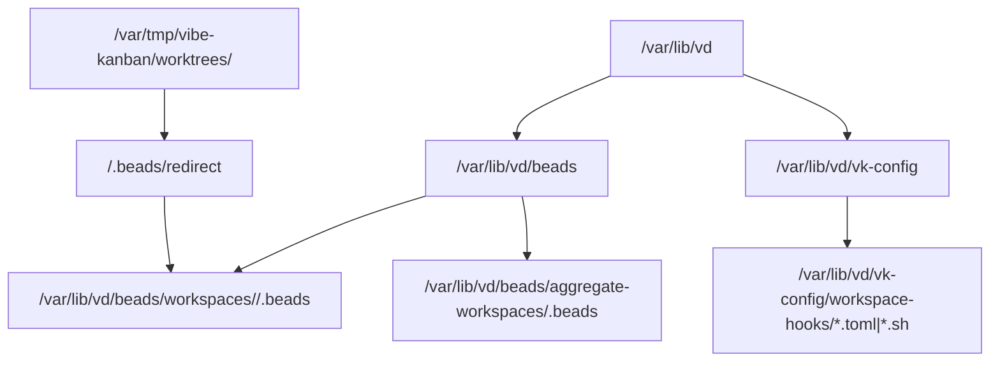
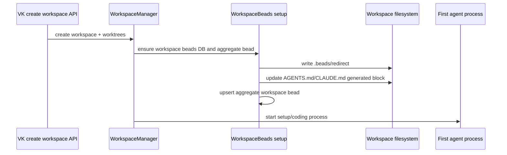
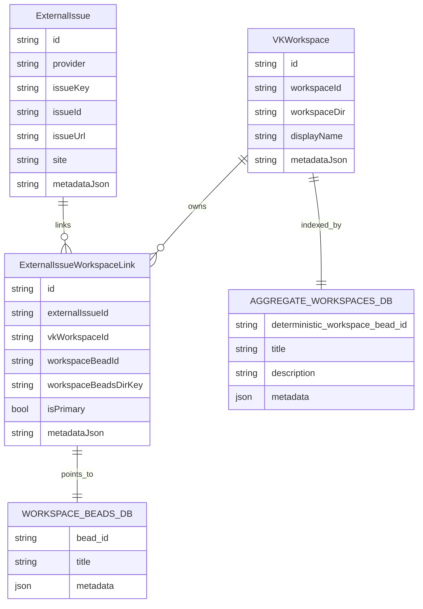

# Per-workspace beads implementation plan

## Goal

Move beads from repo-scoped usage to workspace-scoped usage:

- each VK workspace gets a durable beads DB under `/var/lib/vd/beads`;
- the workspace root gets `.beads/redirect` pointing at that DB;
- generated workspace instructions tell agents to run `bd` from the workspace root;
- a machine-wide aggregate DB has one deterministic bead per workspace;
- external issue links create one workspace-local bead per external issue and record that bead on the VD SQL link row.

## Assumptions

- `bd` native `.beads/redirect` is the primary routing mechanism.
- Actual beads databases live under `/var/lib/vd/beads`, not under `VK_SETTINGS_DIRECTORY`.
- `VK_SETTINGS_DIRECTORY` still exists for version-controllable machine/workspace hook config and defaults to `/var/lib/vd/vk-config` in VD Docker.
- Generated per-workspace beads DB config uses embedded Dolt, not the current shared-server default.
- Existing repo-scoped beads metadata is migration input only.

## Requirements

1. Workspace bead commands are scoped to the top-level workspace directory, not repository subdirectories.
2. Workspace cleanup must not delete bead data.
3. VK must create beads routing and generated instructions before the first agent session starts.
4. Adding a repo to a workspace updates workspace/aggregate repo metadata.
5. The aggregate workspace DB stores one deterministic bead per workspace.
6. The all-beads aggregate is out of scope for this branch.
7. External issue workspace links own their workspace-local bead pointer.
8. Punt copies a bead into the destination workspace, links source/destination, then closes the original as moved.
9. External provider import/sync is out of scope; data model fields may store snapshots/comments-ready metadata.

## Design

### Storage layout



Use absolute redirect targets by default. Keep a flat-file policy so deployments can choose relative redirect targets later.

### Workspace creation flow



The generated block is owned and idempotent:

```md
<!-- BEGIN VK WORKSPACE BEADS -->
## Workspace Beads

Run `bd` commands from this workspace root/top-level directory.
This workspace uses `.beads/redirect` to store beads in persisted VD storage.
Do not initialize beads inside repository subdirectories.
<!-- END VK WORKSPACE BEADS -->
```

Config files can change this wording and whether to write AGENTS.md, CLAUDE.md, or both.

### Databases



`workspaceBeadsDirKey` should be a stable key such as `workspace:<workspace-id>`, not just an ephemeral filesystem path. Resolve it through `/var/lib/vd/beads/workspaces/<workspace-id>/.beads`.

### Aggregate workspace bead

ID:

- deterministic from workspace UUID;
- uses a bd-safe namespace/prefix, e.g. `vkw-<base32-or-base36-workspace-id>`.

Title/body:

- title: workspace display name or first prompt summary;
- description: human-browsable workspace summary;
- if the workspace was created from a primary external issue, include the primary issue body/text and source URL.

Metadata:

```json
{
  "kind": "vk_workspace",
  "workspaceId": "...",
  "workspacePath": "...",
  "repos": [{ "id": "...", "name": "...", "targetBranch": "..." }],
  "primaryExternalIssue": {
    "provider": "jira",
    "key": "VD-123",
    "url": "https://...",
    "title": "...",
    "status": "...",
    "snapshotBody": "..."
  },
  "externalIssues": [
    { "provider": "jira", "key": "VD-456", "url": "https://...", "isPrimary": false }
  ]
}
```

### Workspace-local external issue bead

Created on `ExternalIssueWorkspaceLink` creation.

Title:

```text
[Jira VD-123] Original issue title
```

Body:

```md
Source: https://...
Provider: jira
Key: VD-123

<copied issue body if available>
```

Metadata:

```json
{
  "external_issues": [
    {
      "provider": "jira",
      "key": "VD-123",
      "url": "https://...",
      "site": "team.atlassian.net",
      "id": "10001"
    }
  ],
  "vdExternalIssueId": "...",
  "vdWorkspaceLinkId": "...",
  "vkWorkspaceId": "...",
  "beadsDirKey": "workspace:<workspace-id>",
  "kind": "external_issue"
}
```

No provider status writes in this branch. Future provider updates should be agent-authored comments/status updates on the external issue.

## Build plan

### 1. VK flat settings and VD Docker defaults

- Add `VK_SETTINGS_DIRECTORY` resolution in VK.
- Default VD compose/image env to `/var/lib/vd/vk-config`.
- Add `/var/lib/vd/beads` directory creation in VD image/startup.
- Keep beads DB storage separate from settings.

Tests:

- unit test default path resolution;
- compose/Dockerfile smoke check for env/default directory.

### 2. VK workspace beads setup primitive

Add a small VK service/function that takes:

- workspace ID;
- workspace root path;
- workspace display name;
- repo list;
- optional primary external issue snapshot.

It:

1. creates `/var/lib/vd/beads/workspaces/<workspace-id>/.beads`;
2. initializes it with embedded Dolt config if missing;
3. writes `<workspace-root>/.beads/redirect`;
4. inserts/updates generated AGENTS.md/CLAUDE.md block;
5. upserts aggregate workspace bead in `/var/lib/vd/beads/aggregate-workspaces/.beads`.

Tests:

- idempotent repeated setup;
- redirect file points at absolute persisted path;
- generated block preserves existing repo import lines and human text;
- aggregate bead repo metadata updates when repo list changes.

### 3. Wire setup into VK workspace lifecycle

Call the primitive from:

- initial workspace create/ensure path before first agent start;
- `ensure_container_exists` when a cleaned worktree is recreated;
- add-workspace-repo path after the repo is attached.

Tests:

- workspace creation runs beads setup before `start_execution`;
- worktree recreation restores redirect/instructions without deleting DB;
- adding a repo updates aggregate metadata.

### 4. VD external issue SQL migration

Add columns to `ExternalIssueWorkspaceLink`:

- `workspaceBeadId TEXT`;
- `workspaceBeadsDirKey TEXT`.

Indexes:

- `(workspaceBeadsDirKey, workspaceBeadId)`;
- maybe unique `(vkWorkspaceId, workspaceBeadId)` if bd IDs are unique only per workspace DB.

Update `kysely_types.ts`.

Tests:

- migration creates columns and indexes;
- existing rows survive with null bead pointer.

### 5. VD workspace-local external issue bead creation

Extend `upsertExternalIssueWorkspaceMapping` flow:

1. upsert SQL external issue/workspace/link rows;
2. resolve workspace beads DB from `workspace.workspaceId`;
3. create/find workspace-local external issue bead;
4. update `ExternalIssueWorkspaceLink.workspaceBeadId/workspaceBeadsDirKey`;
5. stamp metadata.external_issues plus VD IDs on the bead.

Use current `beadExternalIssues.ts` parser/writer as the compatibility contract; do not make it the authoritative lookup.

Tests:

- link creation creates a bead exactly once;
- repeated link upsert reuses existing bead;
- bead metadata contains `external_issues`, `vdExternalIssueId`, `vdWorkspaceLinkId`;
- SQL link points to the bead;
- bd failure returns a useful error and does not corrupt SQL state. If a SQL row was inserted before bd failure, rerun must repair it.

### 6. Aggregate workspace bead external issue metadata

When external issue links change:

- update aggregate workspace bead external summary;
- store full snapshot only for primary external issue;
- keep non-primary linked issues compact.

Tests:

- primary issue body appears in aggregate bead description;
- non-primary issue body is not copied;
- aggregate remains browsable in plain `bd show`.

### 7. Punt CLI

Add a VK or VD CLI command:

```bash
vk beads punt --bead <id> --from-workspace <id> --to-workspace <id>
```

Behavior:

1. read source bead from source workspace DB;
2. create copied bead in destination workspace DB;
3. link metadata both ways;
4. close original as moved.

Tests:

- copy preserves title/body/metadata;
- original closes with moved note;
- destination bead points back to source;
- invalid workspace/bead fails without partial close.

### 8. One-time migration command

Add an explicit migration command, not a runtime scan:

```bash
vk beads migrate-repo-scoped --dry-run
vk beads migrate-repo-scoped --apply
```

Inputs:

- repo beads with `metadata.VK_WORKSPACE_ID`;
- repo beads with `metadata.external_issues`.

Outputs:

- copied workspace-local beads;
- SQL external issue links where possible;
- aggregate workspace bead updates.

Tests:

- dry run reports planned copies;
- apply is idempotent;
- missing workspace IDs are skipped with report.

## Concerns and expansions

- All-beads aggregate remains deferred.
- External provider import/sync remains deferred.
- Provider comments/status updates are future work.
- Runtime repo-beads scanning is deliberately out; use one-time migration only.
- If embedded Dolt initialization is slow under many concurrent workspaces, measure before adding a queue.

