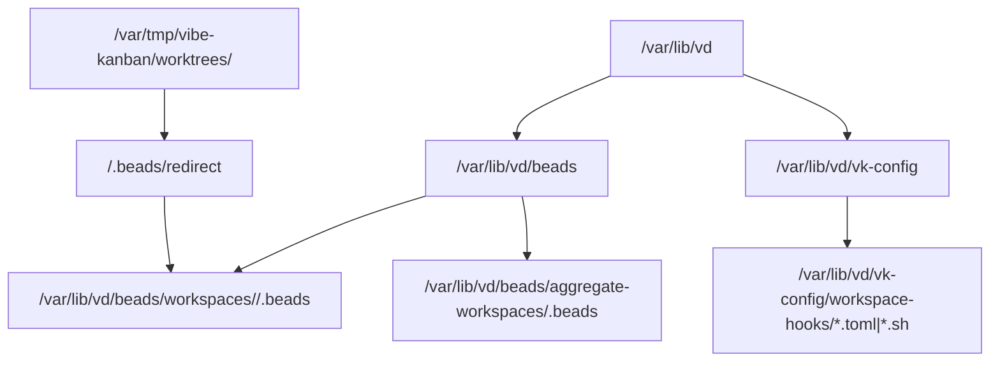
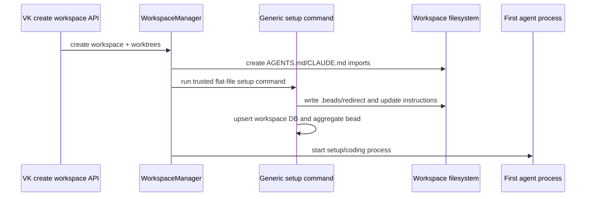
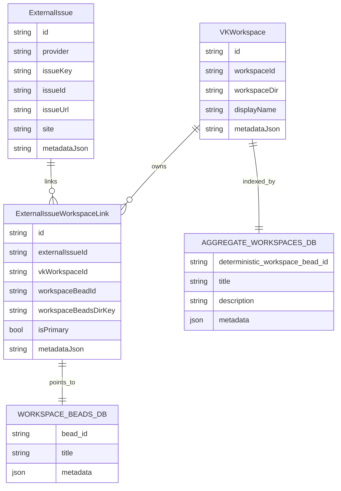

# Per-workspace beads implementation plan

## Goal

Move beads from repo-scoped usage to workspace-scoped usage:

- each workspace gets a durable VD-owned beads DB under `/var/lib/vd/beads`;
- the workspace root gets `.beads/redirect` pointing at that DB;
- generated workspace instructions tell agents to run `bd` from the workspace root;
- a machine-wide aggregate DB has one deterministic bead per workspace;
- external issue links create one workspace-local bead per external issue and record that bead on the VD SQL link row.

## Assumptions

- `bd` native `.beads/redirect` is the primary routing mechanism.
- Actual beads databases live under `/var/lib/vd/beads`, not under `VK_SETTINGS_DIRECTORY`.
- `VK_SETTINGS_DIRECTORY` still exists for generic VK/VD machine config and defaults to `/var/lib/vd/vk-config` in VD Docker.
- `VD_BEADS_DIRECTORY` defaults to `/var/lib/vd/beads` and is owned by VD, not VK.
- VK remains bead-unaware. VK provides only a generic blocking workspace setup command read from trusted `VK_SETTINGS_DIRECTORY` flat-file config.
- VD owns the setup command/script contents; it creates beads routing, instructions, aggregate updates, and any user-configured extra setup.
- Generated per-workspace beads DB config uses embedded Dolt. The current shared Dolt server is migrated away offline.
- Existing repo-scoped beads metadata is migration input only.

## Requirements

1. Workspace bead commands are scoped to the top-level workspace directory, not repository subdirectories.
2. Workspace cleanup must not delete bead data.
3. VK must create workspace `AGENTS.md`/`CLAUDE.md`, then run the generic blocking workspace setup command before the first agent session starts.
4. Adding a repo to a workspace updates workspace/aggregate repo metadata.
5. The aggregate workspace DB stores one deterministic bead per workspace.
6. The all-beads aggregate is out of scope for this branch.
7. External issue workspace links own their workspace-local bead pointer.
8. Punt copies a bead into the destination workspace, links source/destination, then closes the original as moved.
9. External provider import/sync is out of scope; data model fields may store snapshots/comments-ready metadata.

## Design

### Storage layout



Use absolute redirect targets by default. Keep a flat-file policy so deployments can choose relative redirect targets later.

### Workspace creation flow



The generated block is owned and idempotent:

```md
<!-- BEGIN VK WORKSPACE BEADS -->
## Workspace Beads

Run `bd` commands from this workspace root/top-level directory.
This workspace uses `.beads/redirect` to store beads in persisted VD storage.
Do not initialize beads inside repository subdirectories.
<!-- END VK WORKSPACE BEADS -->
```

VK stores no beads names in functions, types, or environment variables. It reads only a generic setup command from `VK_SETTINGS_DIRECTORY`, passes workspace metadata, captures logs, enforces a timeout, and fails closed on required setup failure.

Instruction customization uses a TOML manifest plus markdown fragments:

- checked-in VD required beads fragment is always included;
- persisted user append fragment is seeded on first startup only and never overwritten later;
- generated workspace `AGENTS.md`/`CLAUDE.md` receives fully inlined text, not references the agent must follow.

### Databases



`workspaceBeadsDirKey` should be a stable key such as `workspace:<workspace-id>`, not just an ephemeral filesystem path. Resolve it through `/var/lib/vd/beads/workspaces/<workspace-id>/.beads`.

### Aggregate workspace bead

ID:

- deterministic from workspace UUID;
- uses a bd-safe namespace/prefix, e.g. `vkw-<base32-or-base36-workspace-id>`.

Title/body:

- title: workspace display name or first prompt summary;
- description: human-browsable workspace summary;
- if the workspace was created from a primary external issue, include the primary issue body/text and source URL.

Metadata:

```json
{
  "kind": "vk_workspace",
  "workspaceId": "...",
  "workspacePath": "...",
  "repos": [{ "id": "...", "name": "...", "targetBranch": "..." }],
  "primaryExternalIssue": {
    "provider": "jira",
    "key": "VD-123",
    "url": "https://...",
    "title": "...",
    "status": "...",
    "snapshotBody": "..."
  },
  "externalIssues": [
    { "provider": "jira", "key": "VD-456", "url": "https://...", "isPrimary": false }
  ]
}
```

### Workspace-local external issue bead

Created on `ExternalIssueWorkspaceLink` creation.

Title:

```text
[Jira VD-123] Original issue title
```

Body:

```md
Source: https://...
Provider: jira
Key: VD-123

<copied issue body if available>
```

Metadata:

```json
{
  "external_issues": [
    {
      "provider": "jira",
      "key": "VD-123",
      "url": "https://...",
      "site": "team.atlassian.net",
      "id": "10001"
    }
  ],
  "vdExternalIssueId": "...",
  "vdWorkspaceLinkId": "...",
  "vkWorkspaceId": "...",
  "beadsDirKey": "workspace:<workspace-id>",
  "kind": "external_issue"
}
```

No provider status writes in this branch. Future provider updates should be agent-authored comments/status updates on the external issue.

## Build plan

### 1. Update VD/VK config defaults and remove shared-server assumptions

- Keep `VK_SETTINGS_DIRECTORY` for generic persisted config and default VD compose/image env to `/var/lib/vd/vk-config`.
- Add `VD_BEADS_DIRECTORY` in VD only, defaulting to `/var/lib/vd/beads`.
- Add `/var/lib/vd/beads` directory creation in VD image/startup.
- Seed TOML + markdown instruction config into the persisted settings directory without overwriting existing user files.
- Remove shared Dolt server env/config from the steady-state image/compose after migration support exists.

Tests:

- unit test default path resolution;
- seed test proves existing user fragments are not overwritten;
- compose/Dockerfile smoke check for env/default directory and absence of shared-server env.

### 2. VK generic pre-agent overlay primitive

Replace the overlay-only primitive with a generic blocking setup command:

- reads `workspace-setup.toml` from trusted `VK_SETTINGS_DIRECTORY`;
- runs only configured commands from that directory, never repo/workspace files;
- passes workspace ID/path/repo metadata via environment or JSON file;
- runs after VK creates AGENTS.md/CLAUDE.md imports and before agent execution;
- runs after repo-add and on workspace recreate/ensure;
- has timeout, clear logs, and fail-closed behavior when required.

No VK symbol/type/env should mention beads.

Tests:

- missing config is a no-op;
- command timeout fails the agent start/repo-add path with logs;
- command runs after AGENTS.md exists;
- command receives current repo metadata and runs before first agent start.

### 3. VD workspace beads setup using flat-file setup script

VD ensures:

1. `/var/lib/vd/beads/workspaces/<workspace-id>/.beads` exists and uses embedded Dolt;
2. `<workspace-root>/.beads/redirect` points at the absolute persisted path;
3. aggregate workspace bead exists/updates in `/var/lib/vd/beads/aggregate-workspaces/.beads`;
4. workspace instructions are rendered from checked-in required fragment plus persisted user append fragment;
5. VD seeds `workspace-setup.toml`, setup script, and TOML/markdown fragments without overwriting user edits;
6. setup script reads user TOML for extra commands and declarative AGENTS.md additions.

Tests:

- idempotent repeated setup;
- redirect file points at absolute persisted path;
- aggregate bead repo metadata updates when repo list changes;
- worktree recreation restores redirect/instructions without deleting DB.

### 4. VD external issue SQL migration

Add columns to `ExternalIssueWorkspaceLink`:

- `workspaceBeadId TEXT`;
- `workspaceBeadsDirKey TEXT`.

Indexes:

- `(workspaceBeadsDirKey, workspaceBeadId)`;
- maybe unique `(vkWorkspaceId, workspaceBeadId)` if bd IDs are unique only per workspace DB.

Update `kysely_types.ts`.

Tests:

- migration creates columns and indexes;
- existing rows survive with null bead pointer.

### 5. VD workspace-local external issue bead creation

Extend `upsertExternalIssueWorkspaceMapping` flow:

1. upsert SQL external issue/workspace/link rows;
2. resolve workspace beads DB from `workspace.workspaceId`;
3. create/find workspace-local external issue bead;
4. update `ExternalIssueWorkspaceLink.workspaceBeadId/workspaceBeadsDirKey`;
5. stamp metadata.external_issues plus VD IDs on the bead.

Use current `beadExternalIssues.ts` parser/writer as the compatibility contract; do not make it the authoritative lookup.

Tests:

- link creation creates a bead exactly once;
- repeated link upsert reuses existing bead;
- bead metadata contains `external_issues`, `vdExternalIssueId`, `vdWorkspaceLinkId`;
- SQL link points to the bead;
- bd failure returns a useful error and does not corrupt SQL state. If a SQL row was inserted before bd failure, rerun must repair it.

### 6. Aggregate workspace bead external issue metadata

When external issue links change:

- update aggregate workspace bead external summary;
- store full snapshot only for primary external issue;
- keep non-primary linked issues compact.

Tests:

- primary issue body appears in aggregate bead description;
- non-primary issue body is not copied;
- aggregate remains browsable in plain `bd show`.

### 7. Punt command

Deferred. `vd-beads` is no longer a public/operator CLI. If punt is needed
again, add it under a product-facing command such as `vibe-agent beads punt`.

Behavior:

1. read source bead from source workspace DB;
2. for new workspace, confirm repos/branches and prompt before executing;
3. create copied bead in destination workspace DB with `move.pending`;
4. update/link/close source as moved;
5. mark destination `move.complete`;
6. reruns repair either pending or source-updated states.

New workspace defaults to create+start. `--no-start` creates/links only. The canned initial prompt references the destination bead ID and appends optional user text.

Tests:

- copy preserves title/body/metadata;
- original closes with moved note;
- destination bead points back to source;
- invalid workspace/bead fails without partial close;
- pending rerun repairs to complete;
- new workspace path confirms inputs and builds canned prompt.

### 8. Completed one-off migrations

The one-server legacy migration has already been applied. The temporary
shared/global export, session-log evidence scan, and workspace partition
commands were removed from the runtime codebase. If needed again, recover them
from Git history rather than keeping dead migration machinery in the app.

## Concerns and expansions

- All-beads aggregate remains deferred.
- External provider import/sync remains deferred.
- Provider comments/status updates are future work.
- Runtime repo-beads scanning is deliberately out; use one-time migration only.
- If embedded Dolt initialization is slow under many concurrent workspaces, measure before adding a queue.
