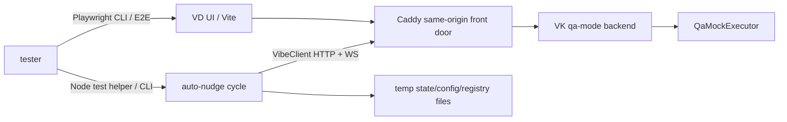
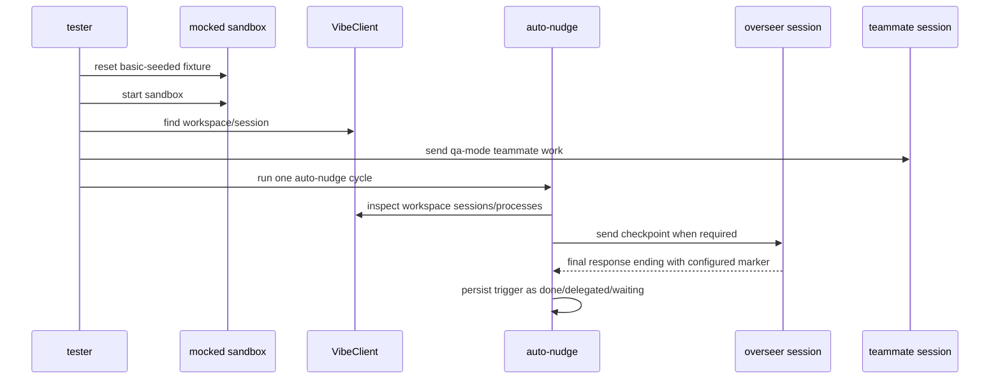

# Auto-nudge mocked-sandbox acceptance plan

This plan covers the `vk/eddf-vd-auto-nudge` branch. It is written for an
independent tester after implementation review is approved.

Use the onboarding docs as the process source:

- `test-plans/onboarding/independent-tester-prompt.md`
- `test-plans/onboarding/vk-mocked-sandbox.md`
- `test-plans/onboarding/playwright-manual-to-e2e.md`

## Goal

Prove the branch behaves correctly at the product boundary: VD opens and drives
real VK `qa-mode` work through the mocked sandbox, while the auto-nudge monitor
uses the same VK HTTP/WebSocket/process contracts it will use in production.

## Assumptions

- The tester runs from `vibe-kanban-vscode-web` on this branch.
- The sibling `Vktest` checkout exists, as required by the mocked sandbox.
- The tester may use the checked-in `basic-seeded` mocked-sandbox fixture unless
  a test case explicitly says to start from `empty`.
- The `qa-mode` executor's final response includes the original prompt text.
  Tests can therefore force suffix end conditions by choosing prompt text that
  ends with `DONE` or `CREATED FORM`.
- Runtime files for the test should be disposable temp files unless a case
  explicitly validates a documented absolute path.

## Requirements

- Acceptance testing must use the VK mocked QA sandbox for real VD/VK
  integration behavior.
- Tester evidence must be recorded as JSON keyed by the `TEST_CASE_*` IDs below.
- Browser-visible behavior must be exercised through VD UI with Playwright CLI
  or through a committed Playwright E2E spec that uses the mocked-sandbox config.
- Auto-nudge process-contract behavior must run against a real sandbox
  `VibeClient`, not only the fake transport.
- Faults that the mocked sandbox cannot naturally force may be validated by the
  existing focused unit/fake-transport tests.
- Do not spend real model-provider tokens.
- Do not mutate real user repositories.

## Design



The sandbox is the right acceptance layer because it keeps VD, Caddy, VK,
session/process persistence, normalized logs, and final-response APIs in the
loop without calling a real model provider.



This sequence is enough to test the branch's production-boundary behavior.
Lower-level tests remain useful for synthetic transport failures that qa-mode
does not expose.

## Setup

From `vibe-kanban-vscode-web`:

```bash
npm run e2e:vk-mocked-sandbox:reset -- --variant basic-seeded
npm run dev:vk-mocked-sandbox
```

Record the printed VD URL. In another shell:

```bash
VD_URL="http://localhost:<printed-caddy-port>"
PW_SESSION="auto-nudge-$(date +%Y%m%d%H%M%S)"
pnpm playwright:cli -s="$PW_SESSION" open "$VD_URL"
pnpm playwright:cli -s="$PW_SESSION" resize 1280 900
pnpm playwright:cli -s="$PW_SESSION" snapshot --json
```

For automated runs, use the mocked-sandbox Playwright config:

```bash
npm run test:e2e:vk-mocked-sandbox
```

If validating the auto-nudge-specific E2E relocation, the test should live under
an auto-nudge feature directory after **vkvw-kr0jy — Move auto-nudge
mocked-sandbox E2E into auto-nudge feature directory** is implemented.

## Test cases

### TEST_CASE_1A — mocked sandbox starts with seeded VD/VK state

Steps:

1. Reset `basic-seeded`.
2. Start `npm run dev:vk-mocked-sandbox`.
3. Open the printed VD URL.
4. Open the seeded craft from VD.

Expected:

- VD loads through the Caddy front door.
- The seeded voyage/craft is visible.
- The VK Agent iframe is same-origin and readable.
- The seeded `qa-mode` transcript is visible.
- No real model-provider tokens are used.

Evidence:

- Commands.
- VD URL.
- Playwright session name.
- Snapshot path.
- Screenshot path.

### TEST_CASE_1B — active qa-mode process suppresses auto-nudge action

Steps:

1. Locate the seeded workspace and teammate session using `VibeClient`.
2. Create an overseer session in the same workspace.
3. Send a qa-mode follow-up to the teammate session.
4. While the teammate process is still `running`, run one auto-nudge cycle with
   disposable state/config/registry paths.

Expected:

- The teammate process appears as `running` through the real session-process
  API/stream.
- Auto-nudge sends no teammate recovery prompt.
- Auto-nudge sends no overseer checkpoint.
- The overseer session still has no new process.

Evidence:

- Workspace ID.
- Teammate session ID.
- Overseer session ID.
- Running process ID.
- Auto-nudge cycle result JSON.

### TEST_CASE_2A — checkpoint closes on configured `DONE` suffix

Steps:

1. Write a disposable nudge config whose `overseerPrompt` ends with a final line
   `DONE` and whose `endConditions` include `DONE`.
2. Create a completed teammate process in the seeded workspace by sending a
   qa-mode follow-up and waiting for terminal status.
3. Run one auto-nudge cycle against the real sandbox.
4. Inspect auto-nudge state.

Expected:

- Auto-nudge sends exactly one checkpoint to the overseer session.
- The qa-mode final response includes the configured prompt and ends with
  `DONE`.
- The trigger status becomes `done`.
- A second cycle does not resend the same checkpoint.

Evidence:

- Nudge config file path and contents.
- Trigger process ID.
- Checkpoint process ID.
- Final response excerpt.
- State JSON excerpt for the trigger.

### TEST_CASE_2B — checkpoint closes on configured `CREATED FORM` suffix

Steps:

1. Write a disposable nudge config whose `overseerPrompt` instructs the overseer
   to create a beads-form and ends with a final line `CREATED FORM`.
2. Ensure `endConditions` include `CREATED FORM`.
3. Create a completed teammate process in the seeded workspace.
4. Run one auto-nudge cycle.
5. Inspect auto-nudge state.

Expected:

- Auto-nudge sends exactly one checkpoint to the overseer session.
- The qa-mode final response ends with `CREATED FORM`.
- The trigger status becomes `done`.
- A later cycle does not keep nudging for the same trigger.

Evidence:

- Nudge config file path and contents.
- Checkpoint final response excerpt.
- State JSON excerpt for the trigger.

### TEST_CASE_2C — end-condition matching is case-sensitive and suffix-only

Steps:

1. Run or inspect the focused unit coverage for `responseMatchesEndCondition`.
2. Include at least these cases:
   - `All done.\nDONE` matches.
   - `Please fill this form.\nCREATED FORM` matches.
   - `done` does not match `DONE`.
   - `CREATED FORM\nmore text` does not match.

Expected:

- Only exact configured markers at the final suffix line close the trigger.

Evidence:

- Test command.
- Passing result.

### TEST_CASE_3A — `vibe-agent auto-nudge enable/status/disable` uses real workspace context

Steps:

1. In the seeded sandbox, choose a real workspace and overseer session.
2. Run `vibe-agent auto-nudge status --json` with `VK_WORKSPACE_ID`,
   `VK_SESSION_ID`, `VIBE_API_URL`, and a disposable
   `VD_AUTO_NUDGE_REGISTRY_PATH`.
3. Run `vibe-agent auto-nudge enable --json`.
4. Run `status --json` again.
5. Run `disable --json`.
6. Run `status --json` again.

Expected:

- Initial status reports disabled.
- Enable records the current workspace and overseer session.
- Status reports enabled with the same registration.
- Disable removes that registration.
- Final status reports disabled.

Evidence:

- Exact commands with secrets redacted.
- JSON outputs.
- Registry file path.

### TEST_CASE_4A — runtime config paths and malformed config behavior

Steps:

1. Run focused tests for runtime nudge config loading.
2. Verify the documented default path:
   `/home/vkuser/.local/share/vibe-dashboard-runtime/data/config/nudge_config.json`.
3. Verify `VD_AUTO_NUDGE_CONFIG_PATH` overrides the default.
4. Verify malformed config falls back to defaults and reports a cycle error.

Expected:

- Defaults include `DONE` and `CREATED FORM`.
- Override path is honored.
- Bad config does not crash the monitor and does not silently pass.

Evidence:

- Test command.
- Passing result.
- Any relevant stdout/stderr excerpt.

### TEST_CASE_5A — callback registry suppresses premature checkpointing

Steps:

1. Use the seeded sandbox to create and complete a teammate qa-mode process.
2. Create a durable callback registry entry correlated to that teammate process
   using a disposable callback registry path.
3. Run one auto-nudge cycle against the real sandbox.
4. Inspect state and overseer session processes.

Expected:

- Auto-nudge sends no overseer checkpoint.
- Trigger status becomes `waiting-callback`.
- Overseer process count remains unchanged.

Evidence:

- Callback registry path and entry.
- Trigger process ID.
- State JSON excerpt.
- Overseer process count before/after.

### TEST_CASE_6A — response-route recovery remains covered

Steps:

1. Run the focused fake-transport test that covers accepted-then-dropped
   follow-up recovery.
2. Run the focused legacy CLI test that covers default routed sends being gated
   by the auto-nudge scanner switch.

Expected:

- Response-route recovery test passes.
- Default response routing is unavailable unless `VD_AUTO_NUDGE_ENABLED=true`
  or the sender uses `--fire-and-forget`.

Evidence:

- Test commands.
- Passing result.

### TEST_CASE_7A — sidebar data links open the right folders

Steps:

1. Open VD in the mocked sandbox.
2. Ensure the left sidebar is visible.
3. Locate `Plugin Data`.
4. Locate `Runtime Data`.
5. Use Playwright to read or intercept each link target; avoid leaving the test
   page unless the plan runner prefers opening a new tab.

Expected:

- `Plugin Data` opens a new tab for `/?folder=/var/lib/vd`.
- `Runtime Data` opens a new tab for
  `/?folder=/home/vkuser/.local/share/vibe-dashboard-runtime/data`.
- Both links include `rel="noopener noreferrer"`.
- Link text and titles make the two folders distinguishable.

Evidence:

- Snapshot path.
- Link href/target/rel values.
- Screenshot path.

### TEST_CASE_8A — auto-nudge E2E file lives under the right feature directory

This case is tied to **vkvw-kr0jy — Move auto-nudge mocked-sandbox E2E into
auto-nudge feature directory**.

Steps:

1. Inspect the E2E feature directories.
2. Confirm the auto-nudge mocked-sandbox compatibility spec is no longer under
   `tests/e2e/features/3237-vd-mocked-model/`.
3. Confirm it lives under an auto-nudge-specific directory.
4. Confirm the mocked-sandbox Playwright config still includes/runs it.

Expected:

- The auto-nudge E2E path names the auto-nudge feature.
- The 3237 mocked-model directory contains only mocked-model tests.
- `npm run test:e2e:vk-mocked-sandbox` still runs the auto-nudge E2E coverage.

Evidence:

- File path.
- Relevant Playwright config excerpt.
- Test command and result.

## Supporting validation

Run these focused checks unless a reviewer gives an equivalent newer command:

```bash
npx vitest run --config vitest.server.config.ts \
  scripts/vibe-agent/nudge/auto-nudge.test.ts \
  scripts/vibe-agent/testing/auto-nudge.transport.test.ts \
  scripts/vibe-agent/legacy-cli/vibe-agent.test.ts

npm run check-types
npm run build:vibe-agent-cli
git diff --check
```

If the full mocked-sandbox E2E run is long, use the callback workflow:

```bash
vibe-agent callback "npm run test:e2e:vk-mocked-sandbox"
```

Do not claim the E2E suite passed until the callback or foreground command
reports success.

## Result schema

Record a bead comment using this JSON shape:

```json
{
  "TEST_CASE_1A": {
    "status": "PASS",
    "notes": "VD URL, screenshot path, and snapshot path."
  },
  "TEST_CASE_1B": {
    "status": "PASS",
    "notes": "Auto-nudge cycle result JSON and process IDs."
  }
}
```

Allowed statuses: `PASS`, `FAIL`, `BLOCKED`, `SKIPPED`.

For failures, include:

- failing test case ID;
- observed behavior;
- expected behavior;
- exact command or UI step;
- artifact path;
- smallest actionable fix.

## Concerns & expansions

- The current VK `qa-mode` executor does not provide arbitrary scripted final
  responses. Prompt echo is sufficient for suffix-marker acceptance here. If a
  future feature needs exact assistant output with no prefix, add a small
  scripted qa-mode hook in VK and cover it separately.
- The fake transport remains the better tool for network faults and malformed
  stream frames. Do not force those into browser E2E unless VK grows explicit
  fault injection.
